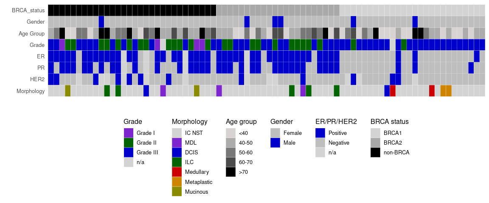
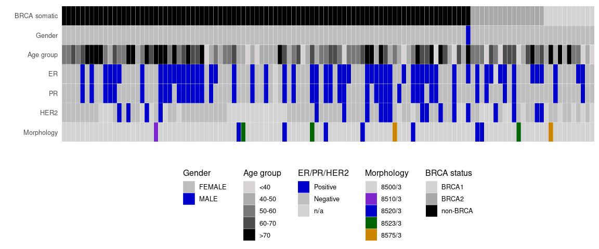

Data resources
================

### Public data

**1. Nones et al 2019**

This dataset composed of tumour/normal WGS data of 78 familial breast
cancer patients. The clinical status of these samples are:

| .        | Freq |
|:---------|-----:|
| BRCA1    |   26 |
| BRCA2    |   22 |
| non-BRCA |   30 |

**2. TCGA-BRCA WGS data**

This dataset was pulled down from TCGA GCD portal and is composed of 116
donors’ data. The basic clinical information are:

### Magic data

- The 157 WGS Tumor/normal paired data
- \~ 300 WES germline data
