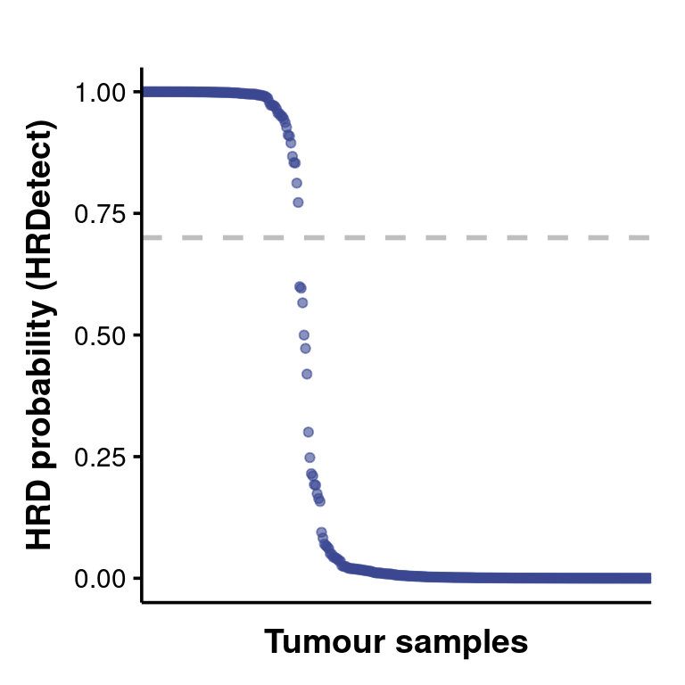
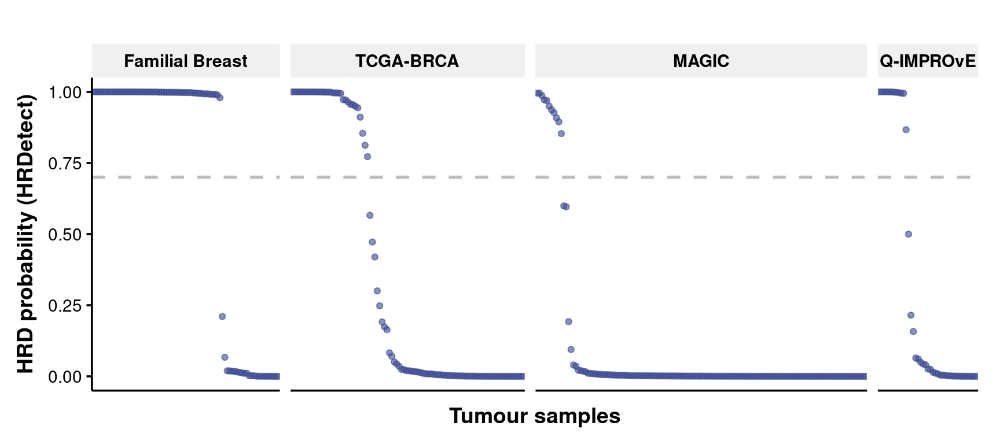
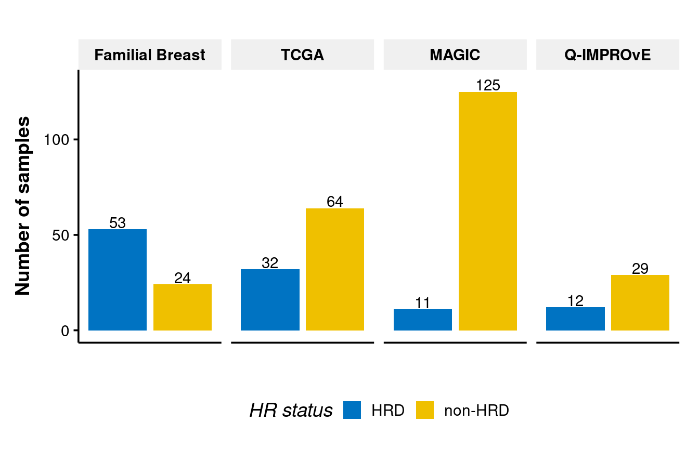
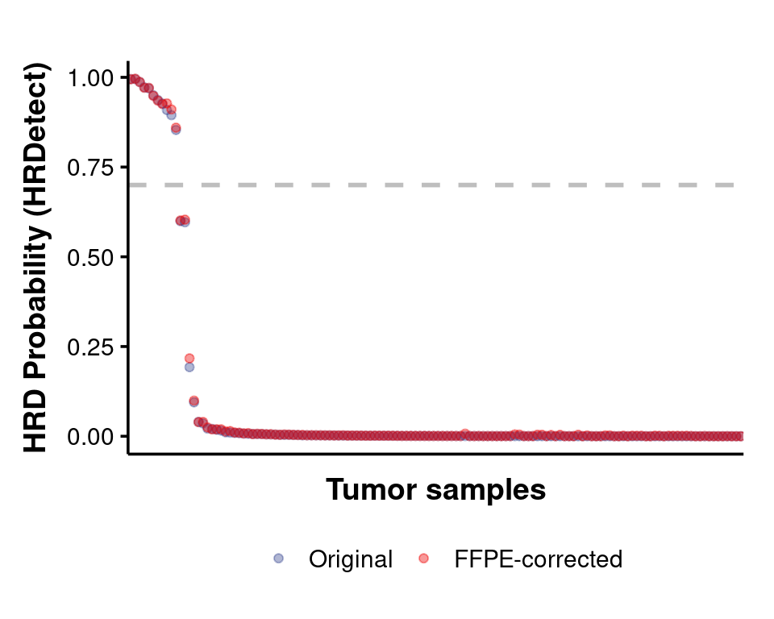

HRDetect HRD prediction
================







## Fix the FFPE impact in MAGIC cohort

We followed the [FFPEsig](https://github.com/QingliGuo/FFPEsig) method
from [Qingli Guo et al.,
2022](https://www.nature.com/articles/s41467-022-32041-5) to correct the
FFPE signatures in samples of MAGIC cohort.

``` bash
python scripts/FFPEsig.py --input data/GRCh38/MAGIC.sorted.matrix.csv --sample $sample --label Unrepaired --output MAGIC_ffpe_unrepaired_fixing
```

Then extracted SBS signatures and predicted HRD with corrected
mutations.

Comparing the HRD prediction results before and after FFPE correction,
there is no impact to number of HRD samples except some minor value
changes.


