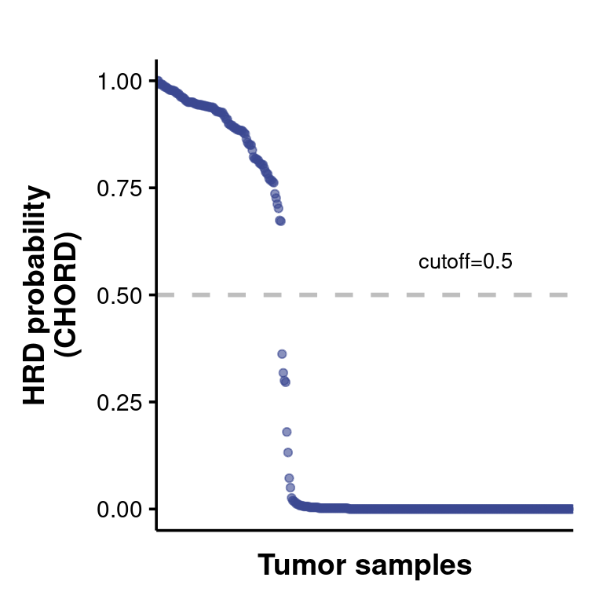
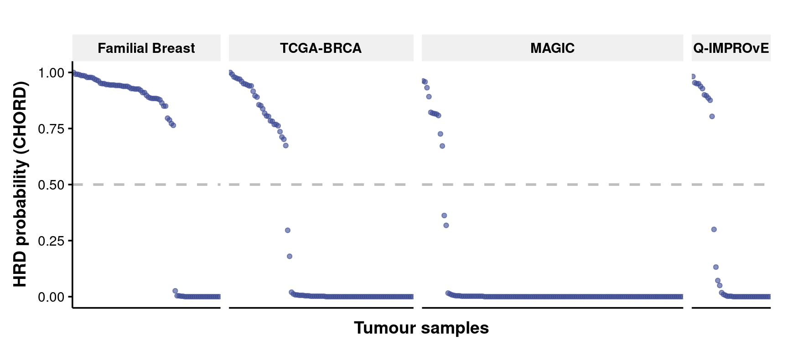
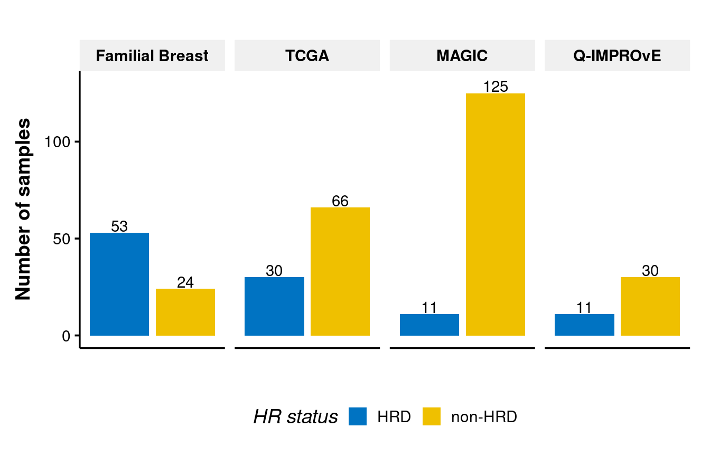
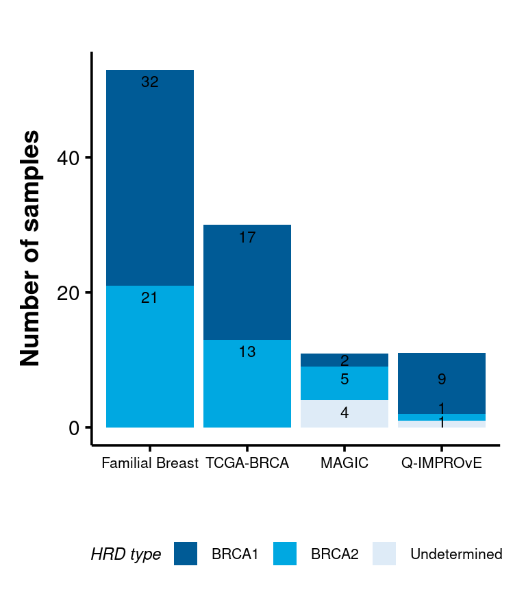
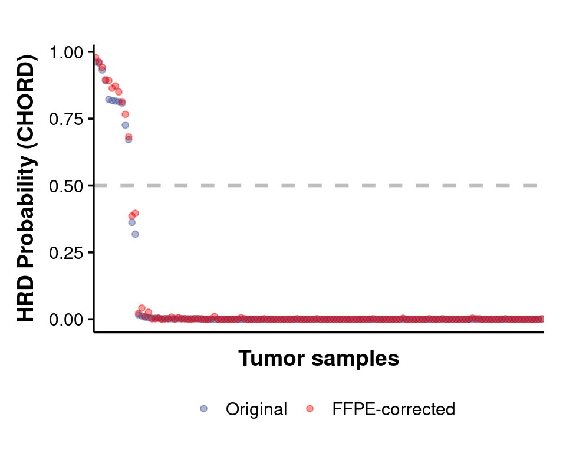
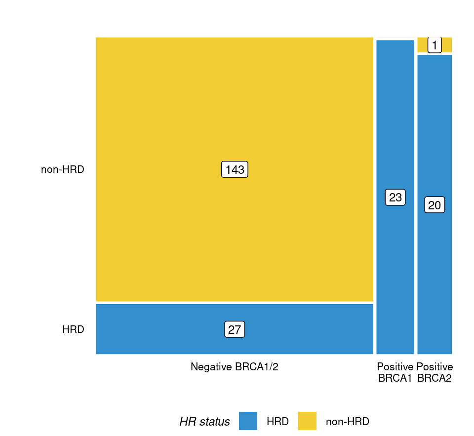
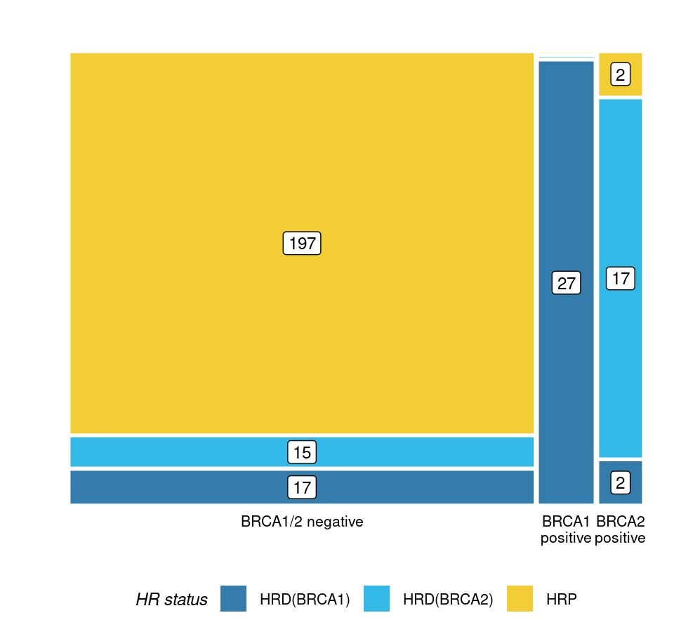

HRD prediction using CHORD
================

**Figure 1: The HRD probability scores for tumour samples**

**Figure 2: The HRD probability scores for tumour samples in four
cohorts**

**Figure 3: The number of individuals identified as HRD or non-HRD in
four cohorts by CHORD**

CHORD can distinguish BRCA1 and BRCA2 type in HRD group.

## CHORD HRD prediction after FFPE impact correction

**Figure 4: The HRD prediction scores before and after FFPE signature
correction**

The likelihood ratio test was performed to evaluate how strong if having
a germline BRCA1/2mutation increases the likelihood of having somatic
HRD based on number of HRD samples in each germline group with VUS
BRCA1/2 group and P/LP or VUS in other genes excluded.

if we include HRD subtypes:

29 had been excluded due to carrying P/LP or suspicious VUS in
non-BRCA1/2 genes, out of these 29 individuals, 4 of them are HRD
(BRCA1), 4 are HRD (BRCA2) and 2 of them are HRD (Undetermined).

