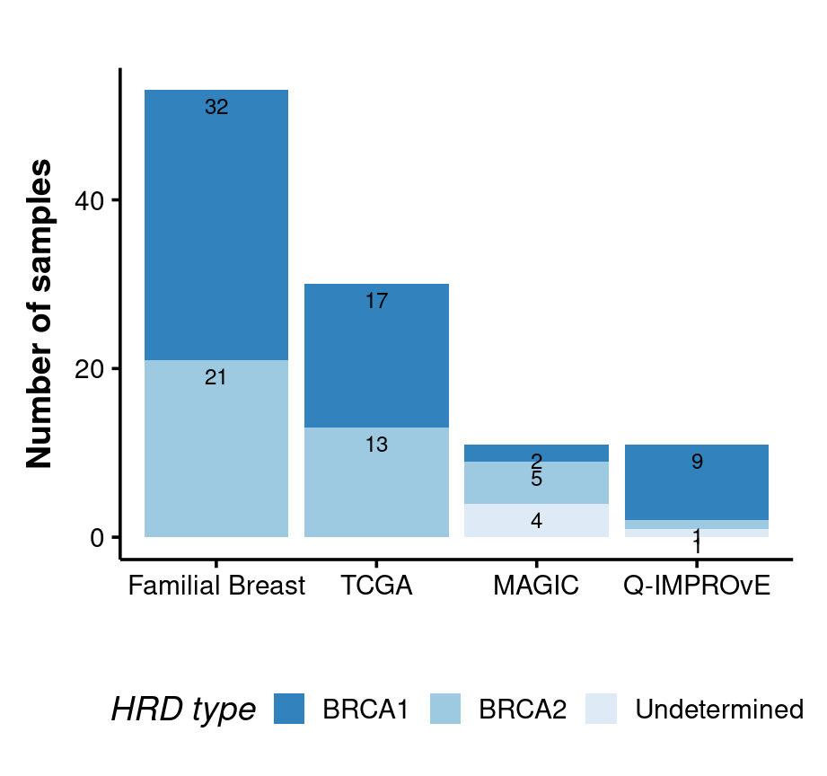

HRD prediction using CHORD
================

**Figure 1: The HRD probability scores for tumour samples**

**Figure 2: The HRD probability scores for tumour samples in four
cohorts**

**Figure 3: The number of individuals identified as HRD or non-HRD in
four cohorts by CHORD**

CHORD can distinguish BRCA1 and BRCA2 type in HRD group.

## CHORD HRD prediction after FFPE impact correction

**Figure 4: The HRD prediction scores before and after FFPE signature
correction**
