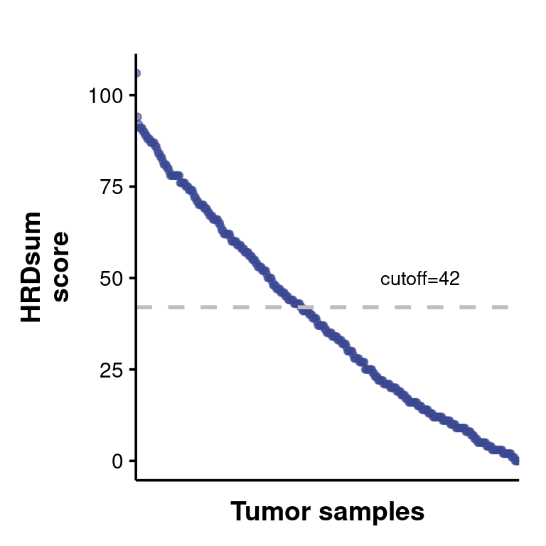
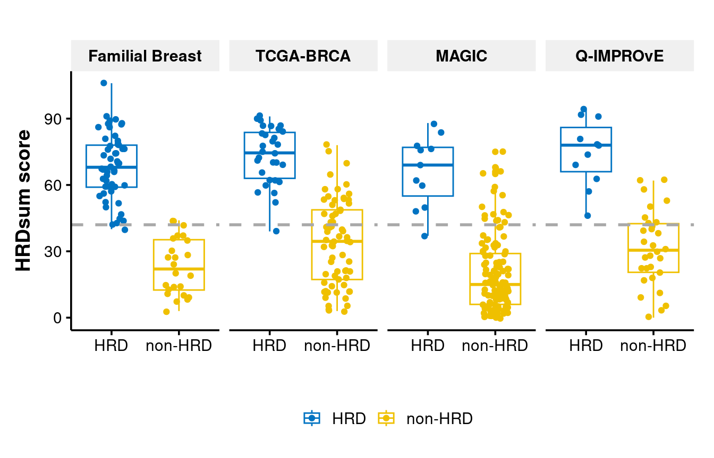
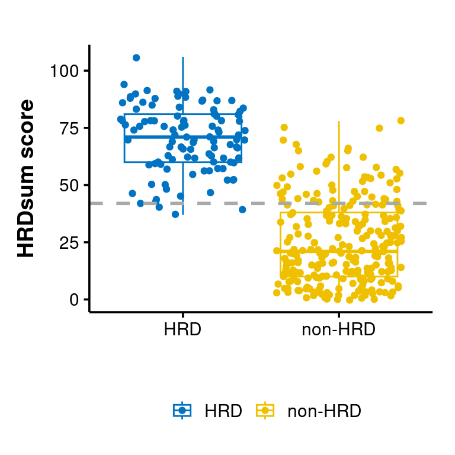

HRDsum scores
================

There is no threshold for HRDsum score for distinguishing HRD samples
from non-HRD samples.

We did see higher HRDsum scores for HRD samples (CHORD) than non-HRD
samples, but there are many overlapping points especially other cohorts
than those Familial breast cancers.

