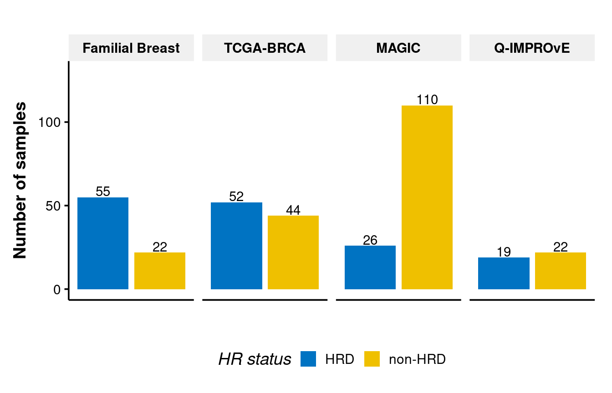

HRDsum scores
================

The HRDsum scores were calculated using the `scar_score()` function of
[modified scripts](scripts/hrdsum.R) based on scarHRD package.

There is no threshold for HRDsum score for distinguishing HRD samples
from non-HRD samples.

**Figure 1: The HRDsum scores for tumour samples**

We did see higher HRDsum scores for HRD samples (CHORD) than non-HRD
samples, but there are many overlapping points especially other cohorts
than those Familial breast cancers.

**Figure 2: The HRDsum scores for tumour samples in four cohorts with
HRD and non-HRD predicted by CHORD. The grey dash line represent the
cut-off value**

**Figure 3: The HRDsum scores for tumour samples with HRD and non-HRD
predicted by CHORD. The grey dash line represent the cut-off value**

Although there is no threshold for HRDsum scores. HRDsum with a cutoff
point of 42 is an FDA‐ and European Medicines Agency (EMA)‐approved
biomarker to select ovarian cancer patients for PARP inhibition.

Here we can see using a cut-off of 42 will predict a lot of non-HRD
(identified by CHORD) as HRD.

**Figure 4: The number of individuals identified as HRD or non-HRD in
four cohorts by HRD-sum score with a cut-off point of 42**
