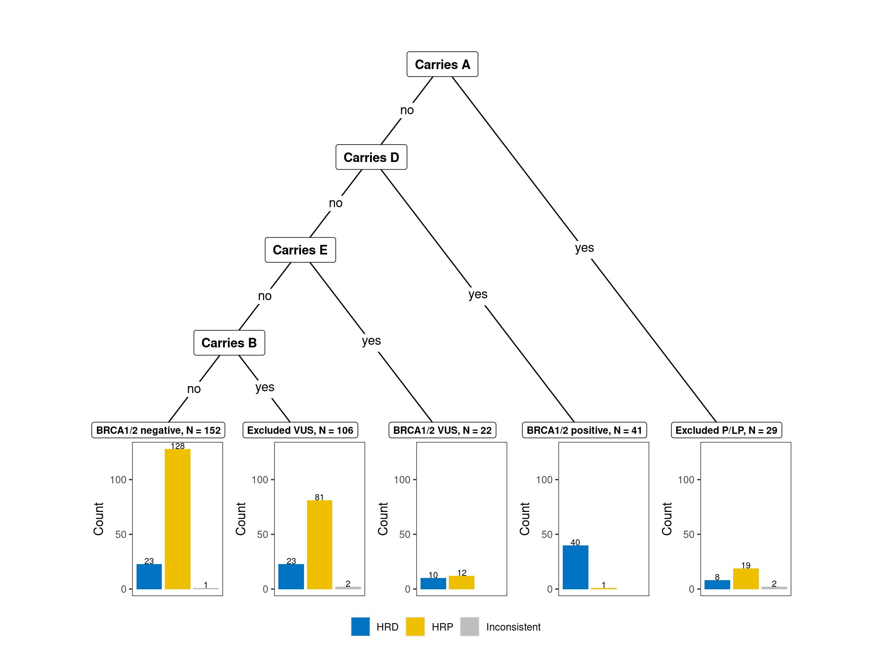
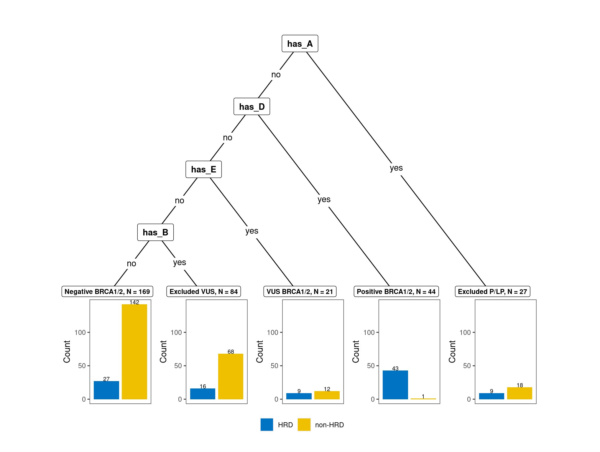

Germline classification
================

With the hypothesis that if tumour HRD profile can inform us about the
pathogenicity of a germline mutation, we need to first classifify
individuals as BRCA1/2_positive or BRCA_negative groups based on their
germline variants.

To stratify individuals, we first collect all germline mutations of each
individual in 10 target genes including BRCA1, BRCA2, PALB2, BARD1,
BRIP1, RAD51C, RAD51D, CHEK2, and ATM. The germline variant calls were
obtain from our best-practice pipeline on HPC and each variant was
annotated using `nanno` tool (better VEP from QIMR).

A set of unique SNVs and indels from all samples were collected for
curation.

``` bash
cat *.filtered.tsv | \
grep -v "#" | \
cut --complement -f 5| \
sort | uniq > BRCA.germline_snv.annotation.tsv
```

After curation, each variant was labbelled as A, B, C, D, E, F class as
below:

<div id="aojqrlznvt" style="padding-left:0px;padding-right:0px;padding-top:10px;padding-bottom:10px;overflow-x:auto;overflow-y:auto;width:auto;height:auto;">
<style>#aojqrlznvt table {
  font-family: system-ui, 'Segoe UI', Roboto, Helvetica, Arial, sans-serif, 'Apple Color Emoji', 'Segoe UI Emoji', 'Segoe UI Symbol', 'Noto Color Emoji';
  -webkit-font-smoothing: antialiased;
  -moz-osx-font-smoothing: grayscale;
}
&#10;#aojqrlznvt thead, #aojqrlznvt tbody, #aojqrlznvt tfoot, #aojqrlznvt tr, #aojqrlznvt td, #aojqrlznvt th {
  border-style: none;
}
&#10;#aojqrlznvt p {
  margin: 0;
  padding: 0;
}
&#10;#aojqrlznvt .gt_table {
  display: table;
  border-collapse: collapse;
  line-height: normal;
  margin-left: auto;
  margin-right: auto;
  color: #333333;
  font-size: 16px;
  font-weight: normal;
  font-style: normal;
  background-color: #FFFFFF;
  width: auto;
  border-top-style: solid;
  border-top-width: 2px;
  border-top-color: #A8A8A8;
  border-right-style: none;
  border-right-width: 2px;
  border-right-color: #D3D3D3;
  border-bottom-style: solid;
  border-bottom-width: 2px;
  border-bottom-color: #A8A8A8;
  border-left-style: none;
  border-left-width: 2px;
  border-left-color: #D3D3D3;
}
&#10;#aojqrlznvt .gt_caption {
  padding-top: 4px;
  padding-bottom: 4px;
}
&#10;#aojqrlznvt .gt_title {
  color: #333333;
  font-size: 125%;
  font-weight: initial;
  padding-top: 4px;
  padding-bottom: 4px;
  padding-left: 5px;
  padding-right: 5px;
  border-bottom-color: #FFFFFF;
  border-bottom-width: 0;
}
&#10;#aojqrlznvt .gt_subtitle {
  color: #333333;
  font-size: 85%;
  font-weight: initial;
  padding-top: 3px;
  padding-bottom: 5px;
  padding-left: 5px;
  padding-right: 5px;
  border-top-color: #FFFFFF;
  border-top-width: 0;
}
&#10;#aojqrlznvt .gt_heading {
  background-color: #FFFFFF;
  text-align: center;
  border-bottom-color: #FFFFFF;
  border-left-style: none;
  border-left-width: 1px;
  border-left-color: #D3D3D3;
  border-right-style: none;
  border-right-width: 1px;
  border-right-color: #D3D3D3;
}
&#10;#aojqrlznvt .gt_bottom_border {
  border-bottom-style: solid;
  border-bottom-width: 2px;
  border-bottom-color: #D3D3D3;
}
&#10;#aojqrlznvt .gt_col_headings {
  border-top-style: solid;
  border-top-width: 2px;
  border-top-color: #D3D3D3;
  border-bottom-style: solid;
  border-bottom-width: 2px;
  border-bottom-color: #D3D3D3;
  border-left-style: none;
  border-left-width: 1px;
  border-left-color: #D3D3D3;
  border-right-style: none;
  border-right-width: 1px;
  border-right-color: #D3D3D3;
}
&#10;#aojqrlznvt .gt_col_heading {
  color: #333333;
  background-color: #FFFFFF;
  font-size: 100%;
  font-weight: normal;
  text-transform: inherit;
  border-left-style: none;
  border-left-width: 1px;
  border-left-color: #D3D3D3;
  border-right-style: none;
  border-right-width: 1px;
  border-right-color: #D3D3D3;
  vertical-align: bottom;
  padding-top: 5px;
  padding-bottom: 6px;
  padding-left: 5px;
  padding-right: 5px;
  overflow-x: hidden;
}
&#10;#aojqrlznvt .gt_column_spanner_outer {
  color: #333333;
  background-color: #FFFFFF;
  font-size: 100%;
  font-weight: normal;
  text-transform: inherit;
  padding-top: 0;
  padding-bottom: 0;
  padding-left: 4px;
  padding-right: 4px;
}
&#10;#aojqrlznvt .gt_column_spanner_outer:first-child {
  padding-left: 0;
}
&#10;#aojqrlznvt .gt_column_spanner_outer:last-child {
  padding-right: 0;
}
&#10;#aojqrlznvt .gt_column_spanner {
  border-bottom-style: solid;
  border-bottom-width: 2px;
  border-bottom-color: #D3D3D3;
  vertical-align: bottom;
  padding-top: 5px;
  padding-bottom: 5px;
  overflow-x: hidden;
  display: inline-block;
  width: 100%;
}
&#10;#aojqrlznvt .gt_spanner_row {
  border-bottom-style: hidden;
}
&#10;#aojqrlznvt .gt_group_heading {
  padding-top: 8px;
  padding-bottom: 8px;
  padding-left: 5px;
  padding-right: 5px;
  color: #333333;
  background-color: #FFFFFF;
  font-size: 100%;
  font-weight: initial;
  text-transform: inherit;
  border-top-style: solid;
  border-top-width: 2px;
  border-top-color: #D3D3D3;
  border-bottom-style: solid;
  border-bottom-width: 2px;
  border-bottom-color: #D3D3D3;
  border-left-style: none;
  border-left-width: 1px;
  border-left-color: #D3D3D3;
  border-right-style: none;
  border-right-width: 1px;
  border-right-color: #D3D3D3;
  vertical-align: middle;
  text-align: left;
}
&#10;#aojqrlznvt .gt_empty_group_heading {
  padding: 0.5px;
  color: #333333;
  background-color: #FFFFFF;
  font-size: 100%;
  font-weight: initial;
  border-top-style: solid;
  border-top-width: 2px;
  border-top-color: #D3D3D3;
  border-bottom-style: solid;
  border-bottom-width: 2px;
  border-bottom-color: #D3D3D3;
  vertical-align: middle;
}
&#10;#aojqrlznvt .gt_from_md > :first-child {
  margin-top: 0;
}
&#10;#aojqrlznvt .gt_from_md > :last-child {
  margin-bottom: 0;
}
&#10;#aojqrlznvt .gt_row {
  padding-top: 8px;
  padding-bottom: 8px;
  padding-left: 5px;
  padding-right: 5px;
  margin: 10px;
  border-top-style: solid;
  border-top-width: 1px;
  border-top-color: #D3D3D3;
  border-left-style: none;
  border-left-width: 1px;
  border-left-color: #D3D3D3;
  border-right-style: none;
  border-right-width: 1px;
  border-right-color: #D3D3D3;
  vertical-align: middle;
  overflow-x: hidden;
}
&#10;#aojqrlznvt .gt_stub {
  color: #333333;
  background-color: #FFFFFF;
  font-size: 100%;
  font-weight: initial;
  text-transform: inherit;
  border-right-style: solid;
  border-right-width: 2px;
  border-right-color: #D3D3D3;
  padding-left: 5px;
  padding-right: 5px;
}
&#10;#aojqrlznvt .gt_stub_row_group {
  color: #333333;
  background-color: #FFFFFF;
  font-size: 100%;
  font-weight: initial;
  text-transform: inherit;
  border-right-style: solid;
  border-right-width: 2px;
  border-right-color: #D3D3D3;
  padding-left: 5px;
  padding-right: 5px;
  vertical-align: top;
}
&#10;#aojqrlznvt .gt_row_group_first td {
  border-top-width: 2px;
}
&#10;#aojqrlznvt .gt_row_group_first th {
  border-top-width: 2px;
}
&#10;#aojqrlznvt .gt_summary_row {
  color: #333333;
  background-color: #FFFFFF;
  text-transform: inherit;
  padding-top: 8px;
  padding-bottom: 8px;
  padding-left: 5px;
  padding-right: 5px;
}
&#10;#aojqrlznvt .gt_first_summary_row {
  border-top-style: solid;
  border-top-color: #D3D3D3;
}
&#10;#aojqrlznvt .gt_first_summary_row.thick {
  border-top-width: 2px;
}
&#10;#aojqrlznvt .gt_last_summary_row {
  padding-top: 8px;
  padding-bottom: 8px;
  padding-left: 5px;
  padding-right: 5px;
  border-bottom-style: solid;
  border-bottom-width: 2px;
  border-bottom-color: #D3D3D3;
}
&#10;#aojqrlznvt .gt_grand_summary_row {
  color: #333333;
  background-color: #FFFFFF;
  text-transform: inherit;
  padding-top: 8px;
  padding-bottom: 8px;
  padding-left: 5px;
  padding-right: 5px;
}
&#10;#aojqrlznvt .gt_first_grand_summary_row {
  padding-top: 8px;
  padding-bottom: 8px;
  padding-left: 5px;
  padding-right: 5px;
  border-top-style: double;
  border-top-width: 6px;
  border-top-color: #D3D3D3;
}
&#10;#aojqrlznvt .gt_last_grand_summary_row_top {
  padding-top: 8px;
  padding-bottom: 8px;
  padding-left: 5px;
  padding-right: 5px;
  border-bottom-style: double;
  border-bottom-width: 6px;
  border-bottom-color: #D3D3D3;
}
&#10;#aojqrlznvt .gt_striped {
  background-color: rgba(128, 128, 128, 0.05);
}
&#10;#aojqrlznvt .gt_table_body {
  border-top-style: solid;
  border-top-width: 2px;
  border-top-color: #D3D3D3;
  border-bottom-style: solid;
  border-bottom-width: 2px;
  border-bottom-color: #D3D3D3;
}
&#10;#aojqrlznvt .gt_footnotes {
  color: #333333;
  background-color: #FFFFFF;
  border-bottom-style: none;
  border-bottom-width: 2px;
  border-bottom-color: #D3D3D3;
  border-left-style: none;
  border-left-width: 2px;
  border-left-color: #D3D3D3;
  border-right-style: none;
  border-right-width: 2px;
  border-right-color: #D3D3D3;
}
&#10;#aojqrlznvt .gt_footnote {
  margin: 0px;
  font-size: 90%;
  padding-top: 4px;
  padding-bottom: 4px;
  padding-left: 5px;
  padding-right: 5px;
}
&#10;#aojqrlznvt .gt_sourcenotes {
  color: #333333;
  background-color: #FFFFFF;
  border-bottom-style: none;
  border-bottom-width: 2px;
  border-bottom-color: #D3D3D3;
  border-left-style: none;
  border-left-width: 2px;
  border-left-color: #D3D3D3;
  border-right-style: none;
  border-right-width: 2px;
  border-right-color: #D3D3D3;
}
&#10;#aojqrlznvt .gt_sourcenote {
  font-size: 90%;
  padding-top: 4px;
  padding-bottom: 4px;
  padding-left: 5px;
  padding-right: 5px;
}
&#10;#aojqrlznvt .gt_left {
  text-align: left;
}
&#10;#aojqrlznvt .gt_center {
  text-align: center;
}
&#10;#aojqrlznvt .gt_right {
  text-align: right;
  font-variant-numeric: tabular-nums;
}
&#10;#aojqrlznvt .gt_font_normal {
  font-weight: normal;
}
&#10;#aojqrlznvt .gt_font_bold {
  font-weight: bold;
}
&#10;#aojqrlznvt .gt_font_italic {
  font-style: italic;
}
&#10;#aojqrlznvt .gt_super {
  font-size: 65%;
}
&#10;#aojqrlznvt .gt_footnote_marks {
  font-size: 75%;
  vertical-align: 0.4em;
  position: initial;
}
&#10;#aojqrlznvt .gt_asterisk {
  font-size: 100%;
  vertical-align: 0;
}
&#10;#aojqrlznvt .gt_indent_1 {
  text-indent: 5px;
}
&#10;#aojqrlznvt .gt_indent_2 {
  text-indent: 10px;
}
&#10;#aojqrlznvt .gt_indent_3 {
  text-indent: 15px;
}
&#10;#aojqrlznvt .gt_indent_4 {
  text-indent: 20px;
}
&#10;#aojqrlznvt .gt_indent_5 {
  text-indent: 25px;
}
&#10;#aojqrlznvt .katex-display {
  display: inline-flex !important;
  margin-bottom: 0.75em !important;
}
&#10;#aojqrlznvt div.Reactable > div.rt-table > div.rt-thead > div.rt-tr.rt-tr-group-header > div.rt-th-group:after {
  height: 0px !important;
}
</style>
<table class="gt_table" data-quarto-disable-processing="false" data-quarto-bootstrap="false">
  <thead>
    <tr class="gt_col_headings">
      <th class="gt_col_heading gt_columns_bottom_border gt_left" rowspan="1" colspan="1" scope="col" id="Variant-class">Variant class</th>
      <th class="gt_col_heading gt_columns_bottom_border gt_left" rowspan="1" colspan="1" scope="col" id="Criteria">Criteria</th>
      <th class="gt_col_heading gt_columns_bottom_border gt_right" rowspan="1" colspan="1" scope="col" id="N">N</th>
    </tr>
  </thead>
  <tbody class="gt_table_body">
    <tr><td headers="Variant class" class="gt_row gt_left">A</td>
<td headers="Criteria" class="gt_row gt_left">Pathogenic or hot VUS in HR genes other than BRCA1/2, and also ATM, CHEK2</td>
<td headers="N" class="gt_row gt_right">28</td></tr>
    <tr><td headers="Variant class" class="gt_row gt_left">B</td>
<td headers="Criteria" class="gt_row gt_left">(cold) VUS in HR genes other than BRCA1/2, and also ATM, CHEK2</td>
<td headers="N" class="gt_row gt_right">178</td></tr>
    <tr><td headers="Variant class" class="gt_row gt_left">C</td>
<td headers="Criteria" class="gt_row gt_left">Benign/Likely benign variants in HR genes other than BRCA1/2, and also ATM, CHEK2</td>
<td headers="N" class="gt_row gt_right">9332</td></tr>
    <tr><td headers="Variant class" class="gt_row gt_left">D</td>
<td headers="Criteria" class="gt_row gt_left">Pathogenic variants in BRCA1 or BRCA2</td>
<td headers="N" class="gt_row gt_right">40</td></tr>
    <tr><td headers="Variant class" class="gt_row gt_left">E</td>
<td headers="Criteria" class="gt_row gt_left">VUS in BRCA1 or BRCA2</td>
<td headers="N" class="gt_row gt_right">36</td></tr>
    <tr><td headers="Variant class" class="gt_row gt_left">F</td>
<td headers="Criteria" class="gt_row gt_left">Benign/Likely benign variants in BRCA1 and/or BRCA2</td>
<td headers="N" class="gt_row gt_right">2457</td></tr>
  </tbody>
  &#10;  <tfoot class="gt_footnotes">
    <tr>
      <td class="gt_footnote" colspan="3"> <span class='gt_from_md'><em>Genes included: BRCA1, BRCA2, PALB2, BARD1 ,BRIP1, RAD51C, RAD51D, CHEK2, ATM</em></span></td>
    </tr>
  </tfoot>
</table>
</div>

Next, we went through each sample, and labelled them as BRCA1/2_positive
or BRCA1/2_negative using
[labbel_individual.py](scripts/labbel_individual.py). Furthermore, to
avoid the noise from pathogenic variants of other genes, we excluded
samples if P/LP variants of other genes (class A) or VUS of other
genes(class B) were present in one. In addition, we separated
individuals with VUS_BRCA (class E) variants but not others as the
Additional group for further investigation.

``` bash
cut -f1,2,3,4,8,95 BRCA.germline_snvs.annotation_cf.txt > germline_mutation_classification.txt. # get chr, position, ref, alt, gene_name, Group(variat_class) columns from xlsx by CF.
for file in *.filtered.tsv; do 
  python labbel_individual.py $file >> sample_classification.txt
done
```

We merged with this classification with thier tumour HRD profiles and
generate a big table.

<div id="lfjixocsgd" style="padding-left:0px;padding-right:0px;padding-top:10px;padding-bottom:10px;overflow-x:auto;overflow-y:auto;width:auto;height:auto;">
<style>#lfjixocsgd table {
  font-family: system-ui, 'Segoe UI', Roboto, Helvetica, Arial, sans-serif, 'Apple Color Emoji', 'Segoe UI Emoji', 'Segoe UI Symbol', 'Noto Color Emoji';
  -webkit-font-smoothing: antialiased;
  -moz-osx-font-smoothing: grayscale;
}
&#10;#lfjixocsgd thead, #lfjixocsgd tbody, #lfjixocsgd tfoot, #lfjixocsgd tr, #lfjixocsgd td, #lfjixocsgd th {
  border-style: none;
}
&#10;#lfjixocsgd p {
  margin: 0;
  padding: 0;
}
&#10;#lfjixocsgd .gt_table {
  display: table;
  border-collapse: collapse;
  line-height: normal;
  margin-left: auto;
  margin-right: auto;
  color: #333333;
  font-size: 16px;
  font-weight: normal;
  font-style: normal;
  background-color: #FFFFFF;
  width: auto;
  border-top-style: solid;
  border-top-width: 2px;
  border-top-color: #A8A8A8;
  border-right-style: none;
  border-right-width: 2px;
  border-right-color: #D3D3D3;
  border-bottom-style: solid;
  border-bottom-width: 2px;
  border-bottom-color: #A8A8A8;
  border-left-style: none;
  border-left-width: 2px;
  border-left-color: #D3D3D3;
}
&#10;#lfjixocsgd .gt_caption {
  padding-top: 4px;
  padding-bottom: 4px;
}
&#10;#lfjixocsgd .gt_title {
  color: #333333;
  font-size: 125%;
  font-weight: initial;
  padding-top: 4px;
  padding-bottom: 4px;
  padding-left: 5px;
  padding-right: 5px;
  border-bottom-color: #FFFFFF;
  border-bottom-width: 0;
}
&#10;#lfjixocsgd .gt_subtitle {
  color: #333333;
  font-size: 85%;
  font-weight: initial;
  padding-top: 3px;
  padding-bottom: 5px;
  padding-left: 5px;
  padding-right: 5px;
  border-top-color: #FFFFFF;
  border-top-width: 0;
}
&#10;#lfjixocsgd .gt_heading {
  background-color: #FFFFFF;
  text-align: center;
  border-bottom-color: #FFFFFF;
  border-left-style: none;
  border-left-width: 1px;
  border-left-color: #D3D3D3;
  border-right-style: none;
  border-right-width: 1px;
  border-right-color: #D3D3D3;
}
&#10;#lfjixocsgd .gt_bottom_border {
  border-bottom-style: solid;
  border-bottom-width: 2px;
  border-bottom-color: #D3D3D3;
}
&#10;#lfjixocsgd .gt_col_headings {
  border-top-style: solid;
  border-top-width: 2px;
  border-top-color: #D3D3D3;
  border-bottom-style: solid;
  border-bottom-width: 2px;
  border-bottom-color: #D3D3D3;
  border-left-style: none;
  border-left-width: 1px;
  border-left-color: #D3D3D3;
  border-right-style: none;
  border-right-width: 1px;
  border-right-color: #D3D3D3;
}
&#10;#lfjixocsgd .gt_col_heading {
  color: #333333;
  background-color: #FFFFFF;
  font-size: 100%;
  font-weight: normal;
  text-transform: inherit;
  border-left-style: none;
  border-left-width: 1px;
  border-left-color: #D3D3D3;
  border-right-style: none;
  border-right-width: 1px;
  border-right-color: #D3D3D3;
  vertical-align: bottom;
  padding-top: 5px;
  padding-bottom: 6px;
  padding-left: 5px;
  padding-right: 5px;
  overflow-x: hidden;
}
&#10;#lfjixocsgd .gt_column_spanner_outer {
  color: #333333;
  background-color: #FFFFFF;
  font-size: 100%;
  font-weight: normal;
  text-transform: inherit;
  padding-top: 0;
  padding-bottom: 0;
  padding-left: 4px;
  padding-right: 4px;
}
&#10;#lfjixocsgd .gt_column_spanner_outer:first-child {
  padding-left: 0;
}
&#10;#lfjixocsgd .gt_column_spanner_outer:last-child {
  padding-right: 0;
}
&#10;#lfjixocsgd .gt_column_spanner {
  border-bottom-style: solid;
  border-bottom-width: 2px;
  border-bottom-color: #D3D3D3;
  vertical-align: bottom;
  padding-top: 5px;
  padding-bottom: 5px;
  overflow-x: hidden;
  display: inline-block;
  width: 100%;
}
&#10;#lfjixocsgd .gt_spanner_row {
  border-bottom-style: hidden;
}
&#10;#lfjixocsgd .gt_group_heading {
  padding-top: 8px;
  padding-bottom: 8px;
  padding-left: 5px;
  padding-right: 5px;
  color: #333333;
  background-color: #FFFFFF;
  font-size: 100%;
  font-weight: initial;
  text-transform: inherit;
  border-top-style: solid;
  border-top-width: 2px;
  border-top-color: #D3D3D3;
  border-bottom-style: solid;
  border-bottom-width: 2px;
  border-bottom-color: #D3D3D3;
  border-left-style: none;
  border-left-width: 1px;
  border-left-color: #D3D3D3;
  border-right-style: none;
  border-right-width: 1px;
  border-right-color: #D3D3D3;
  vertical-align: middle;
  text-align: left;
}
&#10;#lfjixocsgd .gt_empty_group_heading {
  padding: 0.5px;
  color: #333333;
  background-color: #FFFFFF;
  font-size: 100%;
  font-weight: initial;
  border-top-style: solid;
  border-top-width: 2px;
  border-top-color: #D3D3D3;
  border-bottom-style: solid;
  border-bottom-width: 2px;
  border-bottom-color: #D3D3D3;
  vertical-align: middle;
}
&#10;#lfjixocsgd .gt_from_md > :first-child {
  margin-top: 0;
}
&#10;#lfjixocsgd .gt_from_md > :last-child {
  margin-bottom: 0;
}
&#10;#lfjixocsgd .gt_row {
  padding-top: 8px;
  padding-bottom: 8px;
  padding-left: 5px;
  padding-right: 5px;
  margin: 10px;
  border-top-style: solid;
  border-top-width: 1px;
  border-top-color: #D3D3D3;
  border-left-style: none;
  border-left-width: 1px;
  border-left-color: #D3D3D3;
  border-right-style: none;
  border-right-width: 1px;
  border-right-color: #D3D3D3;
  vertical-align: middle;
  overflow-x: hidden;
}
&#10;#lfjixocsgd .gt_stub {
  color: #333333;
  background-color: #FFFFFF;
  font-size: 100%;
  font-weight: initial;
  text-transform: inherit;
  border-right-style: solid;
  border-right-width: 2px;
  border-right-color: #D3D3D3;
  padding-left: 5px;
  padding-right: 5px;
}
&#10;#lfjixocsgd .gt_stub_row_group {
  color: #333333;
  background-color: #FFFFFF;
  font-size: 100%;
  font-weight: initial;
  text-transform: inherit;
  border-right-style: solid;
  border-right-width: 2px;
  border-right-color: #D3D3D3;
  padding-left: 5px;
  padding-right: 5px;
  vertical-align: top;
}
&#10;#lfjixocsgd .gt_row_group_first td {
  border-top-width: 2px;
}
&#10;#lfjixocsgd .gt_row_group_first th {
  border-top-width: 2px;
}
&#10;#lfjixocsgd .gt_summary_row {
  color: #333333;
  background-color: #FFFFFF;
  text-transform: inherit;
  padding-top: 8px;
  padding-bottom: 8px;
  padding-left: 5px;
  padding-right: 5px;
}
&#10;#lfjixocsgd .gt_first_summary_row {
  border-top-style: solid;
  border-top-color: #D3D3D3;
}
&#10;#lfjixocsgd .gt_first_summary_row.thick {
  border-top-width: 2px;
}
&#10;#lfjixocsgd .gt_last_summary_row {
  padding-top: 8px;
  padding-bottom: 8px;
  padding-left: 5px;
  padding-right: 5px;
  border-bottom-style: solid;
  border-bottom-width: 2px;
  border-bottom-color: #D3D3D3;
}
&#10;#lfjixocsgd .gt_grand_summary_row {
  color: #333333;
  background-color: #FFFFFF;
  text-transform: inherit;
  padding-top: 8px;
  padding-bottom: 8px;
  padding-left: 5px;
  padding-right: 5px;
}
&#10;#lfjixocsgd .gt_first_grand_summary_row {
  padding-top: 8px;
  padding-bottom: 8px;
  padding-left: 5px;
  padding-right: 5px;
  border-top-style: double;
  border-top-width: 6px;
  border-top-color: #D3D3D3;
}
&#10;#lfjixocsgd .gt_last_grand_summary_row_top {
  padding-top: 8px;
  padding-bottom: 8px;
  padding-left: 5px;
  padding-right: 5px;
  border-bottom-style: double;
  border-bottom-width: 6px;
  border-bottom-color: #D3D3D3;
}
&#10;#lfjixocsgd .gt_striped {
  background-color: rgba(128, 128, 128, 0.05);
}
&#10;#lfjixocsgd .gt_table_body {
  border-top-style: solid;
  border-top-width: 2px;
  border-top-color: #D3D3D3;
  border-bottom-style: solid;
  border-bottom-width: 2px;
  border-bottom-color: #D3D3D3;
}
&#10;#lfjixocsgd .gt_footnotes {
  color: #333333;
  background-color: #FFFFFF;
  border-bottom-style: none;
  border-bottom-width: 2px;
  border-bottom-color: #D3D3D3;
  border-left-style: none;
  border-left-width: 2px;
  border-left-color: #D3D3D3;
  border-right-style: none;
  border-right-width: 2px;
  border-right-color: #D3D3D3;
}
&#10;#lfjixocsgd .gt_footnote {
  margin: 0px;
  font-size: 90%;
  padding-top: 4px;
  padding-bottom: 4px;
  padding-left: 5px;
  padding-right: 5px;
}
&#10;#lfjixocsgd .gt_sourcenotes {
  color: #333333;
  background-color: #FFFFFF;
  border-bottom-style: none;
  border-bottom-width: 2px;
  border-bottom-color: #D3D3D3;
  border-left-style: none;
  border-left-width: 2px;
  border-left-color: #D3D3D3;
  border-right-style: none;
  border-right-width: 2px;
  border-right-color: #D3D3D3;
}
&#10;#lfjixocsgd .gt_sourcenote {
  font-size: 90%;
  padding-top: 4px;
  padding-bottom: 4px;
  padding-left: 5px;
  padding-right: 5px;
}
&#10;#lfjixocsgd .gt_left {
  text-align: left;
}
&#10;#lfjixocsgd .gt_center {
  text-align: center;
}
&#10;#lfjixocsgd .gt_right {
  text-align: right;
  font-variant-numeric: tabular-nums;
}
&#10;#lfjixocsgd .gt_font_normal {
  font-weight: normal;
}
&#10;#lfjixocsgd .gt_font_bold {
  font-weight: bold;
}
&#10;#lfjixocsgd .gt_font_italic {
  font-style: italic;
}
&#10;#lfjixocsgd .gt_super {
  font-size: 65%;
}
&#10;#lfjixocsgd .gt_footnote_marks {
  font-size: 75%;
  vertical-align: 0.4em;
  position: initial;
}
&#10;#lfjixocsgd .gt_asterisk {
  font-size: 100%;
  vertical-align: 0;
}
&#10;#lfjixocsgd .gt_indent_1 {
  text-indent: 5px;
}
&#10;#lfjixocsgd .gt_indent_2 {
  text-indent: 10px;
}
&#10;#lfjixocsgd .gt_indent_3 {
  text-indent: 15px;
}
&#10;#lfjixocsgd .gt_indent_4 {
  text-indent: 20px;
}
&#10;#lfjixocsgd .gt_indent_5 {
  text-indent: 25px;
}
&#10;#lfjixocsgd .katex-display {
  display: inline-flex !important;
  margin-bottom: 0.75em !important;
}
&#10;#lfjixocsgd div.Reactable > div.rt-table > div.rt-thead > div.rt-tr.rt-tr-group-header > div.rt-th-group:after {
  height: 0px !important;
}
</style>
<table class="gt_table" data-quarto-disable-processing="false" data-quarto-bootstrap="false">
  <thead>
    <tr class="gt_col_headings gt_spanner_row">
      <th class="gt_col_heading gt_columns_bottom_border gt_left" rowspan="2" colspan="1" scope="col" id="cohort">cohort</th>
      <th class="gt_col_heading gt_columns_bottom_border gt_left" rowspan="2" colspan="1" scope="col" id="sample_id">sample_id</th>
      <th class="gt_col_heading gt_columns_bottom_border gt_right" rowspan="2" colspan="1" scope="col" id="ascatPurityScore">ascatPurityScore</th>
      <th class="gt_col_heading gt_columns_bottom_border gt_right" rowspan="2" colspan="1" scope="col" id="TMB_nonSyn">TMB_nonSyn</th>
      <th class="gt_center gt_columns_top_border gt_column_spanner_outer" rowspan="1" colspan="5" scope="colgroup" id="**CHORD results**">
        <div class="gt_column_spanner"><span class='gt_from_md'><strong>CHORD results</strong></span></div>
      </th>
      <th class="gt_center gt_columns_top_border gt_column_spanner_outer" rowspan="1" colspan="3" scope="colgroup" id="**HRDetect results**">
        <div class="gt_column_spanner"><span class='gt_from_md'><strong>HRDetect results</strong></span></div>
      </th>
      <th class="gt_center gt_columns_top_border gt_column_spanner_outer" rowspan="1" colspan="4" scope="colgroup" id="**HRsum results**">
        <div class="gt_column_spanner"><span class='gt_from_md'><strong>HRsum results</strong></span></div>
      </th>
      <th class="gt_center gt_columns_top_border gt_column_spanner_outer" rowspan="1" colspan="11" scope="colgroup" id="**Germline classification**">
        <div class="gt_column_spanner"><span class='gt_from_md'><strong>Germline classification</strong></span></div>
      </th>
    </tr>
    <tr class="gt_col_headings">
      <th class="gt_col_heading gt_columns_bottom_border gt_right" rowspan="1" colspan="1" scope="col" id="p_hrd">p_hrd</th>
      <th class="gt_col_heading gt_columns_bottom_border gt_right" rowspan="1" colspan="1" scope="col" id="p_BRCA1">p_BRCA1</th>
      <th class="gt_col_heading gt_columns_bottom_border gt_right" rowspan="1" colspan="1" scope="col" id="p_BRCA2">p_BRCA2</th>
      <th class="gt_col_heading gt_columns_bottom_border gt_left" rowspan="1" colspan="1" scope="col" id="hr_status">hr_status</th>
      <th class="gt_col_heading gt_columns_bottom_border gt_left" rowspan="1" colspan="1" scope="col" id="hrd_type">hrd_type</th>
      <th class="gt_col_heading gt_columns_bottom_border gt_right" rowspan="1" colspan="1" scope="col" id="Probability">Probability</th>
      <th class="gt_col_heading gt_columns_bottom_border gt_right" rowspan="1" colspan="1" scope="col" id="Signature_3">Signature_3</th>
      <th class="gt_col_heading gt_columns_bottom_border gt_right" rowspan="1" colspan="1" scope="col" id="Signature_8">Signature_8</th>
      <th class="gt_col_heading gt_columns_bottom_border gt_right" rowspan="1" colspan="1" scope="col" id="LOH">LOH</th>
      <th class="gt_col_heading gt_columns_bottom_border gt_right" rowspan="1" colspan="1" scope="col" id="TAI">TAI</th>
      <th class="gt_col_heading gt_columns_bottom_border gt_right" rowspan="1" colspan="1" scope="col" id="LST">LST</th>
      <th class="gt_col_heading gt_columns_bottom_border gt_right" rowspan="1" colspan="1" scope="col" id="HRDsum">HRDsum</th>
      <th class="gt_col_heading gt_columns_bottom_border gt_right" rowspan="1" colspan="1" scope="col" id="A">A</th>
      <th class="gt_col_heading gt_columns_bottom_border gt_right" rowspan="1" colspan="1" scope="col" id="B">B</th>
      <th class="gt_col_heading gt_columns_bottom_border gt_right" rowspan="1" colspan="1" scope="col" id="C">C</th>
      <th class="gt_col_heading gt_columns_bottom_border gt_right" rowspan="1" colspan="1" scope="col" id="D">D</th>
      <th class="gt_col_heading gt_columns_bottom_border gt_right" rowspan="1" colspan="1" scope="col" id="E">E</th>
      <th class="gt_col_heading gt_columns_bottom_border gt_right" rowspan="1" colspan="1" scope="col" id="F">F</th>
      <th class="gt_col_heading gt_columns_bottom_border gt_left" rowspan="1" colspan="1" scope="col" id="germline_classification">germline_classification</th>
      <th class="gt_col_heading gt_columns_bottom_border gt_left" rowspan="1" colspan="1" scope="col" id="class_D_mutation">class_D_mutation</th>
      <th class="gt_col_heading gt_columns_bottom_border gt_left" rowspan="1" colspan="1" scope="col" id="class_E_mutations">class_E_mutations</th>
      <th class="gt_col_heading gt_columns_bottom_border gt_left" rowspan="1" colspan="1" scope="col" id="class_A_mutations">class_A_mutations</th>
      <th class="gt_col_heading gt_columns_bottom_border gt_left" rowspan="1" colspan="1" scope="col" id="class_B_mutations">class_B_mutations</th>
    </tr>
  </thead>
  <tbody class="gt_table_body">
    <tr><td headers="cohort" class="gt_row gt_left">Familial Breast</td>
<td headers="sample_id" class="gt_row gt_left">FBC070890</td>
<td headers="ascatPurityScore" class="gt_row gt_right">0.50</td>
<td headers="TMB_nonSyn" class="gt_row gt_right">3.1000</td>
<td headers="p_hrd" class="gt_row gt_right">0.920</td>
<td headers="p_BRCA1" class="gt_row gt_right">0.880</td>
<td headers="p_BRCA2" class="gt_row gt_right">0.040</td>
<td headers="hr_status" class="gt_row gt_left">HR_deficient</td>
<td headers="hrd_type" class="gt_row gt_left">BRCA1_type</td>
<td headers="Probability" class="gt_row gt_right">0.99983860</td>
<td headers="Signature_3" class="gt_row gt_right">0.3459644</td>
<td headers="Signature_8" class="gt_row gt_right">0.22943993</td>
<td headers="LOH" class="gt_row gt_right">24</td>
<td headers="TAI" class="gt_row gt_right">31</td>
<td headers="LST" class="gt_row gt_right">24</td>
<td headers="HRDsum" class="gt_row gt_right">79</td>
<td headers="A" class="gt_row gt_right">0</td>
<td headers="B" class="gt_row gt_right">0</td>
<td headers="C" class="gt_row gt_right">668</td>
<td headers="D" class="gt_row gt_right">1</td>
<td headers="E" class="gt_row gt_right">0</td>
<td headers="F" class="gt_row gt_right">249</td>
<td headers="germline_classification" class="gt_row gt_left">positive_brca1</td>
<td headers="class_D_mutation" class="gt_row gt_left">c.5152+1G&gt;T[18:15|7:30](BRCA1)</td>
<td headers="class_E_mutations" class="gt_row gt_left">NA</td>
<td headers="class_A_mutations" class="gt_row gt_left">NA</td>
<td headers="class_B_mutations" class="gt_row gt_left">NA</td></tr>
    <tr><td headers="cohort" class="gt_row gt_left">Familial Breast</td>
<td headers="sample_id" class="gt_row gt_left">FBC060681</td>
<td headers="ascatPurityScore" class="gt_row gt_right">0.50</td>
<td headers="TMB_nonSyn" class="gt_row gt_right">4.1666</td>
<td headers="p_hrd" class="gt_row gt_right">0.884</td>
<td headers="p_BRCA1" class="gt_row gt_right">0.112</td>
<td headers="p_BRCA2" class="gt_row gt_right">0.772</td>
<td headers="hr_status" class="gt_row gt_left">HR_deficient</td>
<td headers="hrd_type" class="gt_row gt_left">BRCA2_type</td>
<td headers="Probability" class="gt_row gt_right">0.99307469</td>
<td headers="Signature_3" class="gt_row gt_right">0.3792497</td>
<td headers="Signature_8" class="gt_row gt_right">0.37875704</td>
<td headers="LOH" class="gt_row gt_right">12</td>
<td headers="TAI" class="gt_row gt_right">32</td>
<td headers="LST" class="gt_row gt_right">27</td>
<td headers="HRDsum" class="gt_row gt_right">71</td>
<td headers="A" class="gt_row gt_right">0</td>
<td headers="B" class="gt_row gt_right">0</td>
<td headers="C" class="gt_row gt_right">910</td>
<td headers="D" class="gt_row gt_right">0</td>
<td headers="E" class="gt_row gt_right">1</td>
<td headers="F" class="gt_row gt_right">66</td>
<td headers="germline_classification" class="gt_row gt_left">additional_brca2</td>
<td headers="class_D_mutation" class="gt_row gt_left">NA</td>
<td headers="class_E_mutations" class="gt_row gt_left">c.7828G&gt;A(BRCA2)</td>
<td headers="class_A_mutations" class="gt_row gt_left">NA</td>
<td headers="class_B_mutations" class="gt_row gt_left">NA</td></tr>
    <tr><td headers="cohort" class="gt_row gt_left">Familial Breast</td>
<td headers="sample_id" class="gt_row gt_left">FBC061126</td>
<td headers="ascatPurityScore" class="gt_row gt_right">0.25</td>
<td headers="TMB_nonSyn" class="gt_row gt_right">2.3333</td>
<td headers="p_hrd" class="gt_row gt_right">0.944</td>
<td headers="p_BRCA1" class="gt_row gt_right">0.914</td>
<td headers="p_BRCA2" class="gt_row gt_right">0.030</td>
<td headers="hr_status" class="gt_row gt_left">HR_deficient</td>
<td headers="hrd_type" class="gt_row gt_left">BRCA1_type</td>
<td headers="Probability" class="gt_row gt_right">0.99864740</td>
<td headers="Signature_3" class="gt_row gt_right">0.4922677</td>
<td headers="Signature_8" class="gt_row gt_right">0.00000000</td>
<td headers="LOH" class="gt_row gt_right">20</td>
<td headers="TAI" class="gt_row gt_right">31</td>
<td headers="LST" class="gt_row gt_right">17</td>
<td headers="HRDsum" class="gt_row gt_right">68</td>
<td headers="A" class="gt_row gt_right">0</td>
<td headers="B" class="gt_row gt_right">0</td>
<td headers="C" class="gt_row gt_right">905</td>
<td headers="D" class="gt_row gt_right">1</td>
<td headers="E" class="gt_row gt_right">0</td>
<td headers="F" class="gt_row gt_right">151</td>
<td headers="germline_classification" class="gt_row gt_left">positive_brca1</td>
<td headers="class_D_mutation" class="gt_row gt_left">c.70_80delTGTCCCATCTG[16:10|20:32](BRCA1)</td>
<td headers="class_E_mutations" class="gt_row gt_left">NA</td>
<td headers="class_A_mutations" class="gt_row gt_left">NA</td>
<td headers="class_B_mutations" class="gt_row gt_left">NA</td></tr>
    <tr><td headers="cohort" class="gt_row gt_left">Familial Breast</td>
<td headers="sample_id" class="gt_row gt_left">FBC040626</td>
<td headers="ascatPurityScore" class="gt_row gt_right">0.39</td>
<td headers="TMB_nonSyn" class="gt_row gt_right">4.3666</td>
<td headers="p_hrd" class="gt_row gt_right">0.946</td>
<td headers="p_BRCA1" class="gt_row gt_right">0.924</td>
<td headers="p_BRCA2" class="gt_row gt_right">0.022</td>
<td headers="hr_status" class="gt_row gt_left">HR_deficient</td>
<td headers="hrd_type" class="gt_row gt_left">BRCA1_type</td>
<td headers="Probability" class="gt_row gt_right">0.99998589</td>
<td headers="Signature_3" class="gt_row gt_right">0.4633629</td>
<td headers="Signature_8" class="gt_row gt_right">0.11298358</td>
<td headers="LOH" class="gt_row gt_right">15</td>
<td headers="TAI" class="gt_row gt_right">28</td>
<td headers="LST" class="gt_row gt_right">27</td>
<td headers="HRDsum" class="gt_row gt_right">70</td>
<td headers="A" class="gt_row gt_right">0</td>
<td headers="B" class="gt_row gt_right">1</td>
<td headers="C" class="gt_row gt_right">818</td>
<td headers="D" class="gt_row gt_right">0</td>
<td headers="E" class="gt_row gt_right">0</td>
<td headers="F" class="gt_row gt_right">148</td>
<td headers="germline_classification" class="gt_row gt_left">exclude</td>
<td headers="class_D_mutation" class="gt_row gt_left">NA</td>
<td headers="class_E_mutations" class="gt_row gt_left">NA</td>
<td headers="class_A_mutations" class="gt_row gt_left">NA</td>
<td headers="class_B_mutations" class="gt_row gt_left">c.*5548_*5550delTTT(RAD51C)</td></tr>
    <tr><td headers="cohort" class="gt_row gt_left">Familial Breast</td>
<td headers="sample_id" class="gt_row gt_left">FBC070197</td>
<td headers="ascatPurityScore" class="gt_row gt_right">0.50</td>
<td headers="TMB_nonSyn" class="gt_row gt_right">3.4000</td>
<td headers="p_hrd" class="gt_row gt_right">0.944</td>
<td headers="p_BRCA1" class="gt_row gt_right">0.908</td>
<td headers="p_BRCA2" class="gt_row gt_right">0.036</td>
<td headers="hr_status" class="gt_row gt_left">HR_deficient</td>
<td headers="hrd_type" class="gt_row gt_left">BRCA1_type</td>
<td headers="Probability" class="gt_row gt_right">0.99990743</td>
<td headers="Signature_3" class="gt_row gt_right">0.4863912</td>
<td headers="Signature_8" class="gt_row gt_right">0.00000000</td>
<td headers="LOH" class="gt_row gt_right">18</td>
<td headers="TAI" class="gt_row gt_right">23</td>
<td headers="LST" class="gt_row gt_right">26</td>
<td headers="HRDsum" class="gt_row gt_right">67</td>
<td headers="A" class="gt_row gt_right">0</td>
<td headers="B" class="gt_row gt_right">1</td>
<td headers="C" class="gt_row gt_right">846</td>
<td headers="D" class="gt_row gt_right">0</td>
<td headers="E" class="gt_row gt_right">0</td>
<td headers="F" class="gt_row gt_right">304</td>
<td headers="germline_classification" class="gt_row gt_left">exclude</td>
<td headers="class_D_mutation" class="gt_row gt_left">NA</td>
<td headers="class_E_mutations" class="gt_row gt_left">NA</td>
<td headers="class_A_mutations" class="gt_row gt_left">NA</td>
<td headers="class_B_mutations" class="gt_row gt_left">c.-1622T&gt;C(PALB2)</td></tr>
    <tr><td headers="cohort" class="gt_row gt_left">Familial Breast</td>
<td headers="sample_id" class="gt_row gt_left">FBC020636</td>
<td headers="ascatPurityScore" class="gt_row gt_right">0.37</td>
<td headers="TMB_nonSyn" class="gt_row gt_right">1.1666</td>
<td headers="p_hrd" class="gt_row gt_right">0.000</td>
<td headers="p_BRCA1" class="gt_row gt_right">0.000</td>
<td headers="p_BRCA2" class="gt_row gt_right">0.000</td>
<td headers="hr_status" class="gt_row gt_left">HR_proficient</td>
<td headers="hrd_type" class="gt_row gt_left">none</td>
<td headers="Probability" class="gt_row gt_right">0.01825267</td>
<td headers="Signature_3" class="gt_row gt_right">0.1162113</td>
<td headers="Signature_8" class="gt_row gt_right">0.00000000</td>
<td headers="LOH" class="gt_row gt_right">8</td>
<td headers="TAI" class="gt_row gt_right">24</td>
<td headers="LST" class="gt_row gt_right">10</td>
<td headers="HRDsum" class="gt_row gt_right">42</td>
<td headers="A" class="gt_row gt_right">0</td>
<td headers="B" class="gt_row gt_right">0</td>
<td headers="C" class="gt_row gt_right">719</td>
<td headers="D" class="gt_row gt_right">0</td>
<td headers="E" class="gt_row gt_right">0</td>
<td headers="F" class="gt_row gt_right">280</td>
<td headers="germline_classification" class="gt_row gt_left">negative_brca1/2</td>
<td headers="class_D_mutation" class="gt_row gt_left">NA</td>
<td headers="class_E_mutations" class="gt_row gt_left">NA</td>
<td headers="class_A_mutations" class="gt_row gt_left">NA</td>
<td headers="class_B_mutations" class="gt_row gt_left">NA</td></tr>
    <tr><td headers="cohort" class="gt_row gt_left">Familial Breast</td>
<td headers="sample_id" class="gt_row gt_left">FBC090235</td>
<td headers="ascatPurityScore" class="gt_row gt_right">0.48</td>
<td headers="TMB_nonSyn" class="gt_row gt_right">1.7666</td>
<td headers="p_hrd" class="gt_row gt_right">0.942</td>
<td headers="p_BRCA1" class="gt_row gt_right">0.914</td>
<td headers="p_BRCA2" class="gt_row gt_right">0.028</td>
<td headers="hr_status" class="gt_row gt_left">HR_deficient</td>
<td headers="hrd_type" class="gt_row gt_left">BRCA1_type</td>
<td headers="Probability" class="gt_row gt_right">0.99986925</td>
<td headers="Signature_3" class="gt_row gt_right">0.5871670</td>
<td headers="Signature_8" class="gt_row gt_right">0.08503623</td>
<td headers="LOH" class="gt_row gt_right">21</td>
<td headers="TAI" class="gt_row gt_right">30</td>
<td headers="LST" class="gt_row gt_right">23</td>
<td headers="HRDsum" class="gt_row gt_right">74</td>
<td headers="A" class="gt_row gt_right">0</td>
<td headers="B" class="gt_row gt_right">1</td>
<td headers="C" class="gt_row gt_right">956</td>
<td headers="D" class="gt_row gt_right">1</td>
<td headers="E" class="gt_row gt_right">0</td>
<td headers="F" class="gt_row gt_right">151</td>
<td headers="germline_classification" class="gt_row gt_left">positive_brca2</td>
<td headers="class_D_mutation" class="gt_row gt_left">c.574_575delAT[28:24|51:55](BRCA2)</td>
<td headers="class_E_mutations" class="gt_row gt_left">NA</td>
<td headers="class_A_mutations" class="gt_row gt_left">NA</td>
<td headers="class_B_mutations" class="gt_row gt_left">c.*6345G&gt;A(RAD51C)</td></tr>
    <tr><td headers="cohort" class="gt_row gt_left">Familial Breast</td>
<td headers="sample_id" class="gt_row gt_left">FBC061542</td>
<td headers="ascatPurityScore" class="gt_row gt_right">0.55</td>
<td headers="TMB_nonSyn" class="gt_row gt_right">1.9666</td>
<td headers="p_hrd" class="gt_row gt_right">0.992</td>
<td headers="p_BRCA1" class="gt_row gt_right">0.010</td>
<td headers="p_BRCA2" class="gt_row gt_right">0.982</td>
<td headers="hr_status" class="gt_row gt_left">HR_deficient</td>
<td headers="hrd_type" class="gt_row gt_left">BRCA2_type</td>
<td headers="Probability" class="gt_row gt_right">0.99795494</td>
<td headers="Signature_3" class="gt_row gt_right">0.3059083</td>
<td headers="Signature_8" class="gt_row gt_right">0.24561570</td>
<td headers="LOH" class="gt_row gt_right">13</td>
<td headers="TAI" class="gt_row gt_right">21</td>
<td headers="LST" class="gt_row gt_right">22</td>
<td headers="HRDsum" class="gt_row gt_right">56</td>
<td headers="A" class="gt_row gt_right">0</td>
<td headers="B" class="gt_row gt_right">1</td>
<td headers="C" class="gt_row gt_right">695</td>
<td headers="D" class="gt_row gt_right">1</td>
<td headers="E" class="gt_row gt_right">1</td>
<td headers="F" class="gt_row gt_right">137</td>
<td headers="germline_classification" class="gt_row gt_left">positive_brca2</td>
<td headers="class_D_mutation" class="gt_row gt_left">c.6405_6409delCTTAA[26:20|15:45](BRCA2)</td>
<td headers="class_E_mutations" class="gt_row gt_left">c.-1892C&gt;A(BRCA1)</td>
<td headers="class_A_mutations" class="gt_row gt_left">NA</td>
<td headers="class_B_mutations" class="gt_row gt_left">c.-363G&gt;T(BARD1)</td></tr>
    <tr><td headers="cohort" class="gt_row gt_left">Familial Breast</td>
<td headers="sample_id" class="gt_row gt_left">FBC061699</td>
<td headers="ascatPurityScore" class="gt_row gt_right">0.60</td>
<td headers="TMB_nonSyn" class="gt_row gt_right">3.1666</td>
<td headers="p_hrd" class="gt_row gt_right">0.946</td>
<td headers="p_BRCA1" class="gt_row gt_right">0.910</td>
<td headers="p_BRCA2" class="gt_row gt_right">0.036</td>
<td headers="hr_status" class="gt_row gt_left">HR_deficient</td>
<td headers="hrd_type" class="gt_row gt_left">BRCA1_type</td>
<td headers="Probability" class="gt_row gt_right">0.99999423</td>
<td headers="Signature_3" class="gt_row gt_right">0.5026016</td>
<td headers="Signature_8" class="gt_row gt_right">0.07921951</td>
<td headers="LOH" class="gt_row gt_right">32</td>
<td headers="TAI" class="gt_row gt_right">28</td>
<td headers="LST" class="gt_row gt_right">28</td>
<td headers="HRDsum" class="gt_row gt_right">88</td>
<td headers="A" class="gt_row gt_right">0</td>
<td headers="B" class="gt_row gt_right">2</td>
<td headers="C" class="gt_row gt_right">928</td>
<td headers="D" class="gt_row gt_right">1</td>
<td headers="E" class="gt_row gt_right">0</td>
<td headers="F" class="gt_row gt_right">70</td>
<td headers="germline_classification" class="gt_row gt_left">positive_brca1</td>
<td headers="class_D_mutation" class="gt_row gt_left">c.4327C&gt;T[11:10|6:29](BRCA1)</td>
<td headers="class_E_mutations" class="gt_row gt_left">NA</td>
<td headers="class_A_mutations" class="gt_row gt_left">NA</td>
<td headers="class_B_mutations" class="gt_row gt_left">c.*4305delA(RAD51C);c.-1954T&gt;C(BRIP1)</td></tr>
    <tr><td headers="cohort" class="gt_row gt_left">Familial Breast</td>
<td headers="sample_id" class="gt_row gt_left">FBC051334</td>
<td headers="ascatPurityScore" class="gt_row gt_right">0.66</td>
<td headers="TMB_nonSyn" class="gt_row gt_right">5.4666</td>
<td headers="p_hrd" class="gt_row gt_right">0.772</td>
<td headers="p_BRCA1" class="gt_row gt_right">0.200</td>
<td headers="p_BRCA2" class="gt_row gt_right">0.572</td>
<td headers="hr_status" class="gt_row gt_left">HR_deficient</td>
<td headers="hrd_type" class="gt_row gt_left">BRCA2_type</td>
<td headers="Probability" class="gt_row gt_right">0.99948813</td>
<td headers="Signature_3" class="gt_row gt_right">0.2439409</td>
<td headers="Signature_8" class="gt_row gt_right">0.13173320</td>
<td headers="LOH" class="gt_row gt_right">15</td>
<td headers="TAI" class="gt_row gt_right">29</td>
<td headers="LST" class="gt_row gt_right">23</td>
<td headers="HRDsum" class="gt_row gt_right">67</td>
<td headers="A" class="gt_row gt_right">1</td>
<td headers="B" class="gt_row gt_right">3</td>
<td headers="C" class="gt_row gt_right">890</td>
<td headers="D" class="gt_row gt_right">1</td>
<td headers="E" class="gt_row gt_right">0</td>
<td headers="F" class="gt_row gt_right">290</td>
<td headers="germline_classification" class="gt_row gt_left">exclude</td>
<td headers="class_D_mutation" class="gt_row gt_left">c.1842dupT[22:21|9:19](BRCA2)</td>
<td headers="class_E_mutations" class="gt_row gt_left">NA</td>
<td headers="class_A_mutations" class="gt_row gt_left">c.593-11_593-7delTTCTT[12:21|7:39](CHEK2)</td>
<td headers="class_B_mutations" class="gt_row gt_left">c.-4890T&gt;G(BARD1);c.-677C&gt;A(CHEK2);c.-4294G&gt;A(CHEK2)</td></tr>
  </tbody>
  &#10;  
</table>
</div>

### A partition tree of the individual germline classification



We also examed structrual variations (SVs) in samples using `DELLY`. The
SVs in the 10 genes we listed before were extracted for curation, and
those potential pathogenic or hot VUS in other genes excpete BRCA1/2
(class A), pathogenic variants in BRCA1/2 (class D) and VUS in BRCA1/2
(class E) were visually checked in IGV.

Eventually, this results in 7 SVs:

<div id="alisqccjtj" style="padding-left:0px;padding-right:0px;padding-top:10px;padding-bottom:10px;overflow-x:auto;overflow-y:auto;width:auto;height:auto;">
<style>#alisqccjtj table {
  font-family: system-ui, 'Segoe UI', Roboto, Helvetica, Arial, sans-serif, 'Apple Color Emoji', 'Segoe UI Emoji', 'Segoe UI Symbol', 'Noto Color Emoji';
  -webkit-font-smoothing: antialiased;
  -moz-osx-font-smoothing: grayscale;
}
&#10;#alisqccjtj thead, #alisqccjtj tbody, #alisqccjtj tfoot, #alisqccjtj tr, #alisqccjtj td, #alisqccjtj th {
  border-style: none;
}
&#10;#alisqccjtj p {
  margin: 0;
  padding: 0;
}
&#10;#alisqccjtj .gt_table {
  display: table;
  border-collapse: collapse;
  line-height: normal;
  margin-left: auto;
  margin-right: auto;
  color: #333333;
  font-size: 16px;
  font-weight: normal;
  font-style: normal;
  background-color: #FFFFFF;
  width: auto;
  border-top-style: solid;
  border-top-width: 2px;
  border-top-color: #A8A8A8;
  border-right-style: none;
  border-right-width: 2px;
  border-right-color: #D3D3D3;
  border-bottom-style: solid;
  border-bottom-width: 2px;
  border-bottom-color: #A8A8A8;
  border-left-style: none;
  border-left-width: 2px;
  border-left-color: #D3D3D3;
}
&#10;#alisqccjtj .gt_caption {
  padding-top: 4px;
  padding-bottom: 4px;
}
&#10;#alisqccjtj .gt_title {
  color: #333333;
  font-size: 125%;
  font-weight: initial;
  padding-top: 4px;
  padding-bottom: 4px;
  padding-left: 5px;
  padding-right: 5px;
  border-bottom-color: #FFFFFF;
  border-bottom-width: 0;
}
&#10;#alisqccjtj .gt_subtitle {
  color: #333333;
  font-size: 85%;
  font-weight: initial;
  padding-top: 3px;
  padding-bottom: 5px;
  padding-left: 5px;
  padding-right: 5px;
  border-top-color: #FFFFFF;
  border-top-width: 0;
}
&#10;#alisqccjtj .gt_heading {
  background-color: #FFFFFF;
  text-align: center;
  border-bottom-color: #FFFFFF;
  border-left-style: none;
  border-left-width: 1px;
  border-left-color: #D3D3D3;
  border-right-style: none;
  border-right-width: 1px;
  border-right-color: #D3D3D3;
}
&#10;#alisqccjtj .gt_bottom_border {
  border-bottom-style: solid;
  border-bottom-width: 2px;
  border-bottom-color: #D3D3D3;
}
&#10;#alisqccjtj .gt_col_headings {
  border-top-style: solid;
  border-top-width: 2px;
  border-top-color: #D3D3D3;
  border-bottom-style: solid;
  border-bottom-width: 2px;
  border-bottom-color: #D3D3D3;
  border-left-style: none;
  border-left-width: 1px;
  border-left-color: #D3D3D3;
  border-right-style: none;
  border-right-width: 1px;
  border-right-color: #D3D3D3;
}
&#10;#alisqccjtj .gt_col_heading {
  color: #333333;
  background-color: #FFFFFF;
  font-size: 100%;
  font-weight: normal;
  text-transform: inherit;
  border-left-style: none;
  border-left-width: 1px;
  border-left-color: #D3D3D3;
  border-right-style: none;
  border-right-width: 1px;
  border-right-color: #D3D3D3;
  vertical-align: bottom;
  padding-top: 5px;
  padding-bottom: 6px;
  padding-left: 5px;
  padding-right: 5px;
  overflow-x: hidden;
}
&#10;#alisqccjtj .gt_column_spanner_outer {
  color: #333333;
  background-color: #FFFFFF;
  font-size: 100%;
  font-weight: normal;
  text-transform: inherit;
  padding-top: 0;
  padding-bottom: 0;
  padding-left: 4px;
  padding-right: 4px;
}
&#10;#alisqccjtj .gt_column_spanner_outer:first-child {
  padding-left: 0;
}
&#10;#alisqccjtj .gt_column_spanner_outer:last-child {
  padding-right: 0;
}
&#10;#alisqccjtj .gt_column_spanner {
  border-bottom-style: solid;
  border-bottom-width: 2px;
  border-bottom-color: #D3D3D3;
  vertical-align: bottom;
  padding-top: 5px;
  padding-bottom: 5px;
  overflow-x: hidden;
  display: inline-block;
  width: 100%;
}
&#10;#alisqccjtj .gt_spanner_row {
  border-bottom-style: hidden;
}
&#10;#alisqccjtj .gt_group_heading {
  padding-top: 8px;
  padding-bottom: 8px;
  padding-left: 5px;
  padding-right: 5px;
  color: #333333;
  background-color: #FFFFFF;
  font-size: 100%;
  font-weight: initial;
  text-transform: inherit;
  border-top-style: solid;
  border-top-width: 2px;
  border-top-color: #D3D3D3;
  border-bottom-style: solid;
  border-bottom-width: 2px;
  border-bottom-color: #D3D3D3;
  border-left-style: none;
  border-left-width: 1px;
  border-left-color: #D3D3D3;
  border-right-style: none;
  border-right-width: 1px;
  border-right-color: #D3D3D3;
  vertical-align: middle;
  text-align: left;
}
&#10;#alisqccjtj .gt_empty_group_heading {
  padding: 0.5px;
  color: #333333;
  background-color: #FFFFFF;
  font-size: 100%;
  font-weight: initial;
  border-top-style: solid;
  border-top-width: 2px;
  border-top-color: #D3D3D3;
  border-bottom-style: solid;
  border-bottom-width: 2px;
  border-bottom-color: #D3D3D3;
  vertical-align: middle;
}
&#10;#alisqccjtj .gt_from_md > :first-child {
  margin-top: 0;
}
&#10;#alisqccjtj .gt_from_md > :last-child {
  margin-bottom: 0;
}
&#10;#alisqccjtj .gt_row {
  padding-top: 8px;
  padding-bottom: 8px;
  padding-left: 5px;
  padding-right: 5px;
  margin: 10px;
  border-top-style: solid;
  border-top-width: 1px;
  border-top-color: #D3D3D3;
  border-left-style: none;
  border-left-width: 1px;
  border-left-color: #D3D3D3;
  border-right-style: none;
  border-right-width: 1px;
  border-right-color: #D3D3D3;
  vertical-align: middle;
  overflow-x: hidden;
}
&#10;#alisqccjtj .gt_stub {
  color: #333333;
  background-color: #FFFFFF;
  font-size: 100%;
  font-weight: initial;
  text-transform: inherit;
  border-right-style: solid;
  border-right-width: 2px;
  border-right-color: #D3D3D3;
  padding-left: 5px;
  padding-right: 5px;
}
&#10;#alisqccjtj .gt_stub_row_group {
  color: #333333;
  background-color: #FFFFFF;
  font-size: 100%;
  font-weight: initial;
  text-transform: inherit;
  border-right-style: solid;
  border-right-width: 2px;
  border-right-color: #D3D3D3;
  padding-left: 5px;
  padding-right: 5px;
  vertical-align: top;
}
&#10;#alisqccjtj .gt_row_group_first td {
  border-top-width: 2px;
}
&#10;#alisqccjtj .gt_row_group_first th {
  border-top-width: 2px;
}
&#10;#alisqccjtj .gt_summary_row {
  color: #333333;
  background-color: #FFFFFF;
  text-transform: inherit;
  padding-top: 8px;
  padding-bottom: 8px;
  padding-left: 5px;
  padding-right: 5px;
}
&#10;#alisqccjtj .gt_first_summary_row {
  border-top-style: solid;
  border-top-color: #D3D3D3;
}
&#10;#alisqccjtj .gt_first_summary_row.thick {
  border-top-width: 2px;
}
&#10;#alisqccjtj .gt_last_summary_row {
  padding-top: 8px;
  padding-bottom: 8px;
  padding-left: 5px;
  padding-right: 5px;
  border-bottom-style: solid;
  border-bottom-width: 2px;
  border-bottom-color: #D3D3D3;
}
&#10;#alisqccjtj .gt_grand_summary_row {
  color: #333333;
  background-color: #FFFFFF;
  text-transform: inherit;
  padding-top: 8px;
  padding-bottom: 8px;
  padding-left: 5px;
  padding-right: 5px;
}
&#10;#alisqccjtj .gt_first_grand_summary_row {
  padding-top: 8px;
  padding-bottom: 8px;
  padding-left: 5px;
  padding-right: 5px;
  border-top-style: double;
  border-top-width: 6px;
  border-top-color: #D3D3D3;
}
&#10;#alisqccjtj .gt_last_grand_summary_row_top {
  padding-top: 8px;
  padding-bottom: 8px;
  padding-left: 5px;
  padding-right: 5px;
  border-bottom-style: double;
  border-bottom-width: 6px;
  border-bottom-color: #D3D3D3;
}
&#10;#alisqccjtj .gt_striped {
  background-color: rgba(128, 128, 128, 0.05);
}
&#10;#alisqccjtj .gt_table_body {
  border-top-style: solid;
  border-top-width: 2px;
  border-top-color: #D3D3D3;
  border-bottom-style: solid;
  border-bottom-width: 2px;
  border-bottom-color: #D3D3D3;
}
&#10;#alisqccjtj .gt_footnotes {
  color: #333333;
  background-color: #FFFFFF;
  border-bottom-style: none;
  border-bottom-width: 2px;
  border-bottom-color: #D3D3D3;
  border-left-style: none;
  border-left-width: 2px;
  border-left-color: #D3D3D3;
  border-right-style: none;
  border-right-width: 2px;
  border-right-color: #D3D3D3;
}
&#10;#alisqccjtj .gt_footnote {
  margin: 0px;
  font-size: 90%;
  padding-top: 4px;
  padding-bottom: 4px;
  padding-left: 5px;
  padding-right: 5px;
}
&#10;#alisqccjtj .gt_sourcenotes {
  color: #333333;
  background-color: #FFFFFF;
  border-bottom-style: none;
  border-bottom-width: 2px;
  border-bottom-color: #D3D3D3;
  border-left-style: none;
  border-left-width: 2px;
  border-left-color: #D3D3D3;
  border-right-style: none;
  border-right-width: 2px;
  border-right-color: #D3D3D3;
}
&#10;#alisqccjtj .gt_sourcenote {
  font-size: 90%;
  padding-top: 4px;
  padding-bottom: 4px;
  padding-left: 5px;
  padding-right: 5px;
}
&#10;#alisqccjtj .gt_left {
  text-align: left;
}
&#10;#alisqccjtj .gt_center {
  text-align: center;
}
&#10;#alisqccjtj .gt_right {
  text-align: right;
  font-variant-numeric: tabular-nums;
}
&#10;#alisqccjtj .gt_font_normal {
  font-weight: normal;
}
&#10;#alisqccjtj .gt_font_bold {
  font-weight: bold;
}
&#10;#alisqccjtj .gt_font_italic {
  font-style: italic;
}
&#10;#alisqccjtj .gt_super {
  font-size: 65%;
}
&#10;#alisqccjtj .gt_footnote_marks {
  font-size: 75%;
  vertical-align: 0.4em;
  position: initial;
}
&#10;#alisqccjtj .gt_asterisk {
  font-size: 100%;
  vertical-align: 0;
}
&#10;#alisqccjtj .gt_indent_1 {
  text-indent: 5px;
}
&#10;#alisqccjtj .gt_indent_2 {
  text-indent: 10px;
}
&#10;#alisqccjtj .gt_indent_3 {
  text-indent: 15px;
}
&#10;#alisqccjtj .gt_indent_4 {
  text-indent: 20px;
}
&#10;#alisqccjtj .gt_indent_5 {
  text-indent: 25px;
}
&#10;#alisqccjtj .katex-display {
  display: inline-flex !important;
  margin-bottom: 0.75em !important;
}
&#10;#alisqccjtj div.Reactable > div.rt-table > div.rt-thead > div.rt-tr.rt-tr-group-header > div.rt-th-group:after {
  height: 0px !important;
}
</style>
<table class="gt_table" data-quarto-disable-processing="false" data-quarto-bootstrap="false">
  <thead>
    <tr class="gt_col_headings">
      <th class="gt_col_heading gt_columns_bottom_border gt_left" rowspan="1" colspan="1" scope="col" id="chrom1">chrom1</th>
      <th class="gt_col_heading gt_columns_bottom_border gt_right" rowspan="1" colspan="1" scope="col" id="pos1">pos1</th>
      <th class="gt_col_heading gt_columns_bottom_border gt_left" rowspan="1" colspan="1" scope="col" id="chrom2">chrom2</th>
      <th class="gt_col_heading gt_columns_bottom_border gt_right" rowspan="1" colspan="1" scope="col" id="pos2">pos2</th>
      <th class="gt_col_heading gt_columns_bottom_border gt_left" rowspan="1" colspan="1" scope="col" id="ID">ID</th>
      <th class="gt_col_heading gt_columns_bottom_border gt_left" rowspan="1" colspan="1" scope="col" id="SV_type">SV_type</th>
      <th class="gt_col_heading gt_columns_bottom_border gt_right" rowspan="1" colspan="1" scope="col" id="SV_len">SV_len</th>
      <th class="gt_col_heading gt_columns_bottom_border gt_left" rowspan="1" colspan="1" scope="col" id="gene1">gene1</th>
      <th class="gt_col_heading gt_columns_bottom_border gt_left" rowspan="1" colspan="1" scope="col" id="gene2">gene2</th>
      <th class="gt_col_heading gt_columns_bottom_border gt_right" rowspan="1" colspan="1" scope="col" id="frequency">frequency</th>
      <th class="gt_col_heading gt_columns_bottom_border gt_left" rowspan="1" colspan="1" scope="col" id="cohort">cohort</th>
      <th class="gt_col_heading gt_columns_bottom_border gt_left" rowspan="1" colspan="1" scope="col" id="class">class</th>
    </tr>
  </thead>
  <tbody class="gt_table_body">
    <tr><td headers="chrom1" class="gt_row gt_left">chr17</td>
<td headers="pos1" class="gt_row gt_right">58705463</td>
<td headers="chrom2" class="gt_row gt_left">chr17</td>
<td headers="pos2" class="gt_row gt_right">58742054</td>
<td headers="ID" class="gt_row gt_left">DEL02596562</td>
<td headers="SV_type" class="gt_row gt_left">DEL</td>
<td headers="SV_len" class="gt_row gt_right">36592</td>
<td headers="gene1" class="gt_row gt_left">RAD51C</td>
<td headers="gene2" class="gt_row gt_left">NA</td>
<td headers="frequency" class="gt_row gt_right">1/123</td>
<td headers="cohort" class="gt_row gt_left">TCGA</td>
<td headers="class" class="gt_row gt_left">A</td></tr>
    <tr><td headers="chrom1" class="gt_row gt_left">chr16</td>
<td headers="pos1" class="gt_row gt_right">23621945</td>
<td headers="chrom2" class="gt_row gt_left">chr16</td>
<td headers="pos2" class="gt_row gt_right">23626655</td>
<td headers="ID" class="gt_row gt_left">DEL06615919</td>
<td headers="SV_type" class="gt_row gt_left">DEL</td>
<td headers="SV_len" class="gt_row gt_right">4711</td>
<td headers="gene1" class="gt_row gt_left">PALB2</td>
<td headers="gene2" class="gt_row gt_left">PALB2</td>
<td headers="frequency" class="gt_row gt_right">1/162</td>
<td headers="cohort" class="gt_row gt_left">MAGIC</td>
<td headers="class" class="gt_row gt_left">A</td></tr>
    <tr><td headers="chrom1" class="gt_row gt_left">chr13</td>
<td headers="pos1" class="gt_row gt_right">32349801</td>
<td headers="chrom2" class="gt_row gt_left">chr13</td>
<td headers="pos2" class="gt_row gt_right">32360296</td>
<td headers="ID" class="gt_row gt_left">DEL00305108</td>
<td headers="SV_type" class="gt_row gt_left">DEL</td>
<td headers="SV_len" class="gt_row gt_right">10496</td>
<td headers="gene1" class="gt_row gt_left">BRCA2</td>
<td headers="gene2" class="gt_row gt_left">BRCA2</td>
<td headers="frequency" class="gt_row gt_right">1/87</td>
<td headers="cohort" class="gt_row gt_left">Familial</td>
<td headers="class" class="gt_row gt_left">D</td></tr>
    <tr><td headers="chrom1" class="gt_row gt_left">chr13</td>
<td headers="pos1" class="gt_row gt_right">32368030</td>
<td headers="chrom2" class="gt_row gt_left">chr13</td>
<td headers="pos2" class="gt_row gt_right">32375987</td>
<td headers="ID" class="gt_row gt_left">DEL00305118</td>
<td headers="SV_type" class="gt_row gt_left">DEL</td>
<td headers="SV_len" class="gt_row gt_right">7958</td>
<td headers="gene1" class="gt_row gt_left">BRCA2</td>
<td headers="gene2" class="gt_row gt_left">BRCA2</td>
<td headers="frequency" class="gt_row gt_right">1/87</td>
<td headers="cohort" class="gt_row gt_left">Familial</td>
<td headers="class" class="gt_row gt_left">D</td></tr>
    <tr><td headers="chrom1" class="gt_row gt_left">chr13</td>
<td headers="pos1" class="gt_row gt_right">32368031</td>
<td headers="chrom2" class="gt_row gt_left">chr13</td>
<td headers="pos2" class="gt_row gt_right">32371607</td>
<td headers="ID" class="gt_row gt_left">DEL00305119</td>
<td headers="SV_type" class="gt_row gt_left">DEL</td>
<td headers="SV_len" class="gt_row gt_right">3577</td>
<td headers="gene1" class="gt_row gt_left">BRCA2</td>
<td headers="gene2" class="gt_row gt_left">BRCA2</td>
<td headers="frequency" class="gt_row gt_right">1/87</td>
<td headers="cohort" class="gt_row gt_left">Familial</td>
<td headers="class" class="gt_row gt_left">D</td></tr>
    <tr><td headers="chrom1" class="gt_row gt_left">chr17</td>
<td headers="pos1" class="gt_row gt_right">43032542</td>
<td headers="chrom2" class="gt_row gt_left">chr17</td>
<td headers="pos2" class="gt_row gt_right">43051803</td>
<td headers="ID" class="gt_row gt_left">DEL00376994</td>
<td headers="SV_type" class="gt_row gt_left">DEL</td>
<td headers="SV_len" class="gt_row gt_right">19262</td>
<td headers="gene1" class="gt_row gt_left">NA</td>
<td headers="gene2" class="gt_row gt_left">BRCA1</td>
<td headers="frequency" class="gt_row gt_right">1/87</td>
<td headers="cohort" class="gt_row gt_left">Familial</td>
<td headers="class" class="gt_row gt_left">D</td></tr>
    <tr><td headers="chrom1" class="gt_row gt_left">chr17</td>
<td headers="pos1" class="gt_row gt_right">43105816</td>
<td headers="chrom2" class="gt_row gt_left">chr17</td>
<td headers="pos2" class="gt_row gt_right">43107220</td>
<td headers="ID" class="gt_row gt_left">DEL00377012</td>
<td headers="SV_type" class="gt_row gt_left">DEL</td>
<td headers="SV_len" class="gt_row gt_right">1405</td>
<td headers="gene1" class="gt_row gt_left">BRCA1</td>
<td headers="gene2" class="gt_row gt_left">BRCA1</td>
<td headers="frequency" class="gt_row gt_right">1/87</td>
<td headers="cohort" class="gt_row gt_left">Familial</td>
<td headers="class" class="gt_row gt_left">D</td></tr>
  </tbody>
  &#10;  
</table>
</div>

After integrating SV results in individuals classification, 6 samples
were affected by these real SVs, we then updated the germline
classfication for these individuals

<div id="jbpwwvfqxw" style="padding-left:0px;padding-right:0px;padding-top:10px;padding-bottom:10px;overflow-x:auto;overflow-y:auto;width:auto;height:auto;">
<style>#jbpwwvfqxw table {
  font-family: system-ui, 'Segoe UI', Roboto, Helvetica, Arial, sans-serif, 'Apple Color Emoji', 'Segoe UI Emoji', 'Segoe UI Symbol', 'Noto Color Emoji';
  -webkit-font-smoothing: antialiased;
  -moz-osx-font-smoothing: grayscale;
}
&#10;#jbpwwvfqxw thead, #jbpwwvfqxw tbody, #jbpwwvfqxw tfoot, #jbpwwvfqxw tr, #jbpwwvfqxw td, #jbpwwvfqxw th {
  border-style: none;
}
&#10;#jbpwwvfqxw p {
  margin: 0;
  padding: 0;
}
&#10;#jbpwwvfqxw .gt_table {
  display: table;
  border-collapse: collapse;
  line-height: normal;
  margin-left: auto;
  margin-right: auto;
  color: #333333;
  font-size: 16px;
  font-weight: normal;
  font-style: normal;
  background-color: #FFFFFF;
  width: auto;
  border-top-style: solid;
  border-top-width: 2px;
  border-top-color: #A8A8A8;
  border-right-style: none;
  border-right-width: 2px;
  border-right-color: #D3D3D3;
  border-bottom-style: solid;
  border-bottom-width: 2px;
  border-bottom-color: #A8A8A8;
  border-left-style: none;
  border-left-width: 2px;
  border-left-color: #D3D3D3;
}
&#10;#jbpwwvfqxw .gt_caption {
  padding-top: 4px;
  padding-bottom: 4px;
}
&#10;#jbpwwvfqxw .gt_title {
  color: #333333;
  font-size: 125%;
  font-weight: initial;
  padding-top: 4px;
  padding-bottom: 4px;
  padding-left: 5px;
  padding-right: 5px;
  border-bottom-color: #FFFFFF;
  border-bottom-width: 0;
}
&#10;#jbpwwvfqxw .gt_subtitle {
  color: #333333;
  font-size: 85%;
  font-weight: initial;
  padding-top: 3px;
  padding-bottom: 5px;
  padding-left: 5px;
  padding-right: 5px;
  border-top-color: #FFFFFF;
  border-top-width: 0;
}
&#10;#jbpwwvfqxw .gt_heading {
  background-color: #FFFFFF;
  text-align: center;
  border-bottom-color: #FFFFFF;
  border-left-style: none;
  border-left-width: 1px;
  border-left-color: #D3D3D3;
  border-right-style: none;
  border-right-width: 1px;
  border-right-color: #D3D3D3;
}
&#10;#jbpwwvfqxw .gt_bottom_border {
  border-bottom-style: solid;
  border-bottom-width: 2px;
  border-bottom-color: #D3D3D3;
}
&#10;#jbpwwvfqxw .gt_col_headings {
  border-top-style: solid;
  border-top-width: 2px;
  border-top-color: #D3D3D3;
  border-bottom-style: solid;
  border-bottom-width: 2px;
  border-bottom-color: #D3D3D3;
  border-left-style: none;
  border-left-width: 1px;
  border-left-color: #D3D3D3;
  border-right-style: none;
  border-right-width: 1px;
  border-right-color: #D3D3D3;
}
&#10;#jbpwwvfqxw .gt_col_heading {
  color: #333333;
  background-color: #FFFFFF;
  font-size: 100%;
  font-weight: normal;
  text-transform: inherit;
  border-left-style: none;
  border-left-width: 1px;
  border-left-color: #D3D3D3;
  border-right-style: none;
  border-right-width: 1px;
  border-right-color: #D3D3D3;
  vertical-align: bottom;
  padding-top: 5px;
  padding-bottom: 6px;
  padding-left: 5px;
  padding-right: 5px;
  overflow-x: hidden;
}
&#10;#jbpwwvfqxw .gt_column_spanner_outer {
  color: #333333;
  background-color: #FFFFFF;
  font-size: 100%;
  font-weight: normal;
  text-transform: inherit;
  padding-top: 0;
  padding-bottom: 0;
  padding-left: 4px;
  padding-right: 4px;
}
&#10;#jbpwwvfqxw .gt_column_spanner_outer:first-child {
  padding-left: 0;
}
&#10;#jbpwwvfqxw .gt_column_spanner_outer:last-child {
  padding-right: 0;
}
&#10;#jbpwwvfqxw .gt_column_spanner {
  border-bottom-style: solid;
  border-bottom-width: 2px;
  border-bottom-color: #D3D3D3;
  vertical-align: bottom;
  padding-top: 5px;
  padding-bottom: 5px;
  overflow-x: hidden;
  display: inline-block;
  width: 100%;
}
&#10;#jbpwwvfqxw .gt_spanner_row {
  border-bottom-style: hidden;
}
&#10;#jbpwwvfqxw .gt_group_heading {
  padding-top: 8px;
  padding-bottom: 8px;
  padding-left: 5px;
  padding-right: 5px;
  color: #333333;
  background-color: #FFFFFF;
  font-size: 100%;
  font-weight: initial;
  text-transform: inherit;
  border-top-style: solid;
  border-top-width: 2px;
  border-top-color: #D3D3D3;
  border-bottom-style: solid;
  border-bottom-width: 2px;
  border-bottom-color: #D3D3D3;
  border-left-style: none;
  border-left-width: 1px;
  border-left-color: #D3D3D3;
  border-right-style: none;
  border-right-width: 1px;
  border-right-color: #D3D3D3;
  vertical-align: middle;
  text-align: left;
}
&#10;#jbpwwvfqxw .gt_empty_group_heading {
  padding: 0.5px;
  color: #333333;
  background-color: #FFFFFF;
  font-size: 100%;
  font-weight: initial;
  border-top-style: solid;
  border-top-width: 2px;
  border-top-color: #D3D3D3;
  border-bottom-style: solid;
  border-bottom-width: 2px;
  border-bottom-color: #D3D3D3;
  vertical-align: middle;
}
&#10;#jbpwwvfqxw .gt_from_md > :first-child {
  margin-top: 0;
}
&#10;#jbpwwvfqxw .gt_from_md > :last-child {
  margin-bottom: 0;
}
&#10;#jbpwwvfqxw .gt_row {
  padding-top: 8px;
  padding-bottom: 8px;
  padding-left: 5px;
  padding-right: 5px;
  margin: 10px;
  border-top-style: solid;
  border-top-width: 1px;
  border-top-color: #D3D3D3;
  border-left-style: none;
  border-left-width: 1px;
  border-left-color: #D3D3D3;
  border-right-style: none;
  border-right-width: 1px;
  border-right-color: #D3D3D3;
  vertical-align: middle;
  overflow-x: hidden;
}
&#10;#jbpwwvfqxw .gt_stub {
  color: #333333;
  background-color: #FFFFFF;
  font-size: 100%;
  font-weight: initial;
  text-transform: inherit;
  border-right-style: solid;
  border-right-width: 2px;
  border-right-color: #D3D3D3;
  padding-left: 5px;
  padding-right: 5px;
}
&#10;#jbpwwvfqxw .gt_stub_row_group {
  color: #333333;
  background-color: #FFFFFF;
  font-size: 100%;
  font-weight: initial;
  text-transform: inherit;
  border-right-style: solid;
  border-right-width: 2px;
  border-right-color: #D3D3D3;
  padding-left: 5px;
  padding-right: 5px;
  vertical-align: top;
}
&#10;#jbpwwvfqxw .gt_row_group_first td {
  border-top-width: 2px;
}
&#10;#jbpwwvfqxw .gt_row_group_first th {
  border-top-width: 2px;
}
&#10;#jbpwwvfqxw .gt_summary_row {
  color: #333333;
  background-color: #FFFFFF;
  text-transform: inherit;
  padding-top: 8px;
  padding-bottom: 8px;
  padding-left: 5px;
  padding-right: 5px;
}
&#10;#jbpwwvfqxw .gt_first_summary_row {
  border-top-style: solid;
  border-top-color: #D3D3D3;
}
&#10;#jbpwwvfqxw .gt_first_summary_row.thick {
  border-top-width: 2px;
}
&#10;#jbpwwvfqxw .gt_last_summary_row {
  padding-top: 8px;
  padding-bottom: 8px;
  padding-left: 5px;
  padding-right: 5px;
  border-bottom-style: solid;
  border-bottom-width: 2px;
  border-bottom-color: #D3D3D3;
}
&#10;#jbpwwvfqxw .gt_grand_summary_row {
  color: #333333;
  background-color: #FFFFFF;
  text-transform: inherit;
  padding-top: 8px;
  padding-bottom: 8px;
  padding-left: 5px;
  padding-right: 5px;
}
&#10;#jbpwwvfqxw .gt_first_grand_summary_row {
  padding-top: 8px;
  padding-bottom: 8px;
  padding-left: 5px;
  padding-right: 5px;
  border-top-style: double;
  border-top-width: 6px;
  border-top-color: #D3D3D3;
}
&#10;#jbpwwvfqxw .gt_last_grand_summary_row_top {
  padding-top: 8px;
  padding-bottom: 8px;
  padding-left: 5px;
  padding-right: 5px;
  border-bottom-style: double;
  border-bottom-width: 6px;
  border-bottom-color: #D3D3D3;
}
&#10;#jbpwwvfqxw .gt_striped {
  background-color: rgba(128, 128, 128, 0.05);
}
&#10;#jbpwwvfqxw .gt_table_body {
  border-top-style: solid;
  border-top-width: 2px;
  border-top-color: #D3D3D3;
  border-bottom-style: solid;
  border-bottom-width: 2px;
  border-bottom-color: #D3D3D3;
}
&#10;#jbpwwvfqxw .gt_footnotes {
  color: #333333;
  background-color: #FFFFFF;
  border-bottom-style: none;
  border-bottom-width: 2px;
  border-bottom-color: #D3D3D3;
  border-left-style: none;
  border-left-width: 2px;
  border-left-color: #D3D3D3;
  border-right-style: none;
  border-right-width: 2px;
  border-right-color: #D3D3D3;
}
&#10;#jbpwwvfqxw .gt_footnote {
  margin: 0px;
  font-size: 90%;
  padding-top: 4px;
  padding-bottom: 4px;
  padding-left: 5px;
  padding-right: 5px;
}
&#10;#jbpwwvfqxw .gt_sourcenotes {
  color: #333333;
  background-color: #FFFFFF;
  border-bottom-style: none;
  border-bottom-width: 2px;
  border-bottom-color: #D3D3D3;
  border-left-style: none;
  border-left-width: 2px;
  border-left-color: #D3D3D3;
  border-right-style: none;
  border-right-width: 2px;
  border-right-color: #D3D3D3;
}
&#10;#jbpwwvfqxw .gt_sourcenote {
  font-size: 90%;
  padding-top: 4px;
  padding-bottom: 4px;
  padding-left: 5px;
  padding-right: 5px;
}
&#10;#jbpwwvfqxw .gt_left {
  text-align: left;
}
&#10;#jbpwwvfqxw .gt_center {
  text-align: center;
}
&#10;#jbpwwvfqxw .gt_right {
  text-align: right;
  font-variant-numeric: tabular-nums;
}
&#10;#jbpwwvfqxw .gt_font_normal {
  font-weight: normal;
}
&#10;#jbpwwvfqxw .gt_font_bold {
  font-weight: bold;
}
&#10;#jbpwwvfqxw .gt_font_italic {
  font-style: italic;
}
&#10;#jbpwwvfqxw .gt_super {
  font-size: 65%;
}
&#10;#jbpwwvfqxw .gt_footnote_marks {
  font-size: 75%;
  vertical-align: 0.4em;
  position: initial;
}
&#10;#jbpwwvfqxw .gt_asterisk {
  font-size: 100%;
  vertical-align: 0;
}
&#10;#jbpwwvfqxw .gt_indent_1 {
  text-indent: 5px;
}
&#10;#jbpwwvfqxw .gt_indent_2 {
  text-indent: 10px;
}
&#10;#jbpwwvfqxw .gt_indent_3 {
  text-indent: 15px;
}
&#10;#jbpwwvfqxw .gt_indent_4 {
  text-indent: 20px;
}
&#10;#jbpwwvfqxw .gt_indent_5 {
  text-indent: 25px;
}
&#10;#jbpwwvfqxw .katex-display {
  display: inline-flex !important;
  margin-bottom: 0.75em !important;
}
&#10;#jbpwwvfqxw div.Reactable > div.rt-table > div.rt-thead > div.rt-tr.rt-tr-group-header > div.rt-th-group:after {
  height: 0px !important;
}
</style>
<table class="gt_table" data-quarto-disable-processing="false" data-quarto-bootstrap="false">
  <thead>
    <tr class="gt_col_headings">
      <th class="gt_col_heading gt_columns_bottom_border gt_left" rowspan="1" colspan="1" scope="col" id="sample_id">sample_id</th>
      <th class="gt_col_heading gt_columns_bottom_border gt_left" rowspan="1" colspan="1" scope="col" id="pathSV">pathSV</th>
    </tr>
  </thead>
  <tbody class="gt_table_body">
    <tr><td headers="sample_id" class="gt_row gt_left">FBC020030</td>
<td headers="pathSV" class="gt_row gt_left">D_DEL00377012_DEL_1405_BRCA1_BRCA1</td></tr>
    <tr><td headers="sample_id" class="gt_row gt_left">FBC030010</td>
<td headers="pathSV" class="gt_row gt_left">D_DEL00305108_DEL_10496_BRCA2_BRCA2</td></tr>
    <tr><td headers="sample_id" class="gt_row gt_left">FBC050018</td>
<td headers="pathSV" class="gt_row gt_left">D_DEL00305118_DEL_7958_BRCA2_BRCA2,D_DEL00305119_DEL_3577_BRCA2_BRCA2</td></tr>
    <tr><td headers="sample_id" class="gt_row gt_left">FBC100739</td>
<td headers="pathSV" class="gt_row gt_left">D_DEL00376994_DEL_19262__BRCA1</td></tr>
    <tr><td headers="sample_id" class="gt_row gt_left">MAGIC_2020_043</td>
<td headers="pathSV" class="gt_row gt_left">A_DEL06615919_DEL_4711_PALB2_PALB2</td></tr>
    <tr><td headers="sample_id" class="gt_row gt_left">TCGA-A8-A075</td>
<td headers="pathSV" class="gt_row gt_left">A_DEL02596562_DEL_36592_RAD51C_</td></tr>
  </tbody>
  &#10;  
</table>
</div>
<div id="sklbolnxav" style="padding-left:0px;padding-right:0px;padding-top:10px;padding-bottom:10px;overflow-x:auto;overflow-y:auto;width:auto;height:auto;">
<style>#sklbolnxav table {
  font-family: system-ui, 'Segoe UI', Roboto, Helvetica, Arial, sans-serif, 'Apple Color Emoji', 'Segoe UI Emoji', 'Segoe UI Symbol', 'Noto Color Emoji';
  -webkit-font-smoothing: antialiased;
  -moz-osx-font-smoothing: grayscale;
}
&#10;#sklbolnxav thead, #sklbolnxav tbody, #sklbolnxav tfoot, #sklbolnxav tr, #sklbolnxav td, #sklbolnxav th {
  border-style: none;
}
&#10;#sklbolnxav p {
  margin: 0;
  padding: 0;
}
&#10;#sklbolnxav .gt_table {
  display: table;
  border-collapse: collapse;
  line-height: normal;
  margin-left: auto;
  margin-right: auto;
  color: #333333;
  font-size: 16px;
  font-weight: normal;
  font-style: normal;
  background-color: #FFFFFF;
  width: auto;
  border-top-style: solid;
  border-top-width: 2px;
  border-top-color: #A8A8A8;
  border-right-style: none;
  border-right-width: 2px;
  border-right-color: #D3D3D3;
  border-bottom-style: solid;
  border-bottom-width: 2px;
  border-bottom-color: #A8A8A8;
  border-left-style: none;
  border-left-width: 2px;
  border-left-color: #D3D3D3;
}
&#10;#sklbolnxav .gt_caption {
  padding-top: 4px;
  padding-bottom: 4px;
}
&#10;#sklbolnxav .gt_title {
  color: #333333;
  font-size: 125%;
  font-weight: initial;
  padding-top: 4px;
  padding-bottom: 4px;
  padding-left: 5px;
  padding-right: 5px;
  border-bottom-color: #FFFFFF;
  border-bottom-width: 0;
}
&#10;#sklbolnxav .gt_subtitle {
  color: #333333;
  font-size: 85%;
  font-weight: initial;
  padding-top: 3px;
  padding-bottom: 5px;
  padding-left: 5px;
  padding-right: 5px;
  border-top-color: #FFFFFF;
  border-top-width: 0;
}
&#10;#sklbolnxav .gt_heading {
  background-color: #FFFFFF;
  text-align: center;
  border-bottom-color: #FFFFFF;
  border-left-style: none;
  border-left-width: 1px;
  border-left-color: #D3D3D3;
  border-right-style: none;
  border-right-width: 1px;
  border-right-color: #D3D3D3;
}
&#10;#sklbolnxav .gt_bottom_border {
  border-bottom-style: solid;
  border-bottom-width: 2px;
  border-bottom-color: #D3D3D3;
}
&#10;#sklbolnxav .gt_col_headings {
  border-top-style: solid;
  border-top-width: 2px;
  border-top-color: #D3D3D3;
  border-bottom-style: solid;
  border-bottom-width: 2px;
  border-bottom-color: #D3D3D3;
  border-left-style: none;
  border-left-width: 1px;
  border-left-color: #D3D3D3;
  border-right-style: none;
  border-right-width: 1px;
  border-right-color: #D3D3D3;
}
&#10;#sklbolnxav .gt_col_heading {
  color: #333333;
  background-color: #FFFFFF;
  font-size: 100%;
  font-weight: normal;
  text-transform: inherit;
  border-left-style: none;
  border-left-width: 1px;
  border-left-color: #D3D3D3;
  border-right-style: none;
  border-right-width: 1px;
  border-right-color: #D3D3D3;
  vertical-align: bottom;
  padding-top: 5px;
  padding-bottom: 6px;
  padding-left: 5px;
  padding-right: 5px;
  overflow-x: hidden;
}
&#10;#sklbolnxav .gt_column_spanner_outer {
  color: #333333;
  background-color: #FFFFFF;
  font-size: 100%;
  font-weight: normal;
  text-transform: inherit;
  padding-top: 0;
  padding-bottom: 0;
  padding-left: 4px;
  padding-right: 4px;
}
&#10;#sklbolnxav .gt_column_spanner_outer:first-child {
  padding-left: 0;
}
&#10;#sklbolnxav .gt_column_spanner_outer:last-child {
  padding-right: 0;
}
&#10;#sklbolnxav .gt_column_spanner {
  border-bottom-style: solid;
  border-bottom-width: 2px;
  border-bottom-color: #D3D3D3;
  vertical-align: bottom;
  padding-top: 5px;
  padding-bottom: 5px;
  overflow-x: hidden;
  display: inline-block;
  width: 100%;
}
&#10;#sklbolnxav .gt_spanner_row {
  border-bottom-style: hidden;
}
&#10;#sklbolnxav .gt_group_heading {
  padding-top: 8px;
  padding-bottom: 8px;
  padding-left: 5px;
  padding-right: 5px;
  color: #333333;
  background-color: #FFFFFF;
  font-size: 100%;
  font-weight: initial;
  text-transform: inherit;
  border-top-style: solid;
  border-top-width: 2px;
  border-top-color: #D3D3D3;
  border-bottom-style: solid;
  border-bottom-width: 2px;
  border-bottom-color: #D3D3D3;
  border-left-style: none;
  border-left-width: 1px;
  border-left-color: #D3D3D3;
  border-right-style: none;
  border-right-width: 1px;
  border-right-color: #D3D3D3;
  vertical-align: middle;
  text-align: left;
}
&#10;#sklbolnxav .gt_empty_group_heading {
  padding: 0.5px;
  color: #333333;
  background-color: #FFFFFF;
  font-size: 100%;
  font-weight: initial;
  border-top-style: solid;
  border-top-width: 2px;
  border-top-color: #D3D3D3;
  border-bottom-style: solid;
  border-bottom-width: 2px;
  border-bottom-color: #D3D3D3;
  vertical-align: middle;
}
&#10;#sklbolnxav .gt_from_md > :first-child {
  margin-top: 0;
}
&#10;#sklbolnxav .gt_from_md > :last-child {
  margin-bottom: 0;
}
&#10;#sklbolnxav .gt_row {
  padding-top: 8px;
  padding-bottom: 8px;
  padding-left: 5px;
  padding-right: 5px;
  margin: 10px;
  border-top-style: solid;
  border-top-width: 1px;
  border-top-color: #D3D3D3;
  border-left-style: none;
  border-left-width: 1px;
  border-left-color: #D3D3D3;
  border-right-style: none;
  border-right-width: 1px;
  border-right-color: #D3D3D3;
  vertical-align: middle;
  overflow-x: hidden;
}
&#10;#sklbolnxav .gt_stub {
  color: #333333;
  background-color: #FFFFFF;
  font-size: 100%;
  font-weight: initial;
  text-transform: inherit;
  border-right-style: solid;
  border-right-width: 2px;
  border-right-color: #D3D3D3;
  padding-left: 5px;
  padding-right: 5px;
}
&#10;#sklbolnxav .gt_stub_row_group {
  color: #333333;
  background-color: #FFFFFF;
  font-size: 100%;
  font-weight: initial;
  text-transform: inherit;
  border-right-style: solid;
  border-right-width: 2px;
  border-right-color: #D3D3D3;
  padding-left: 5px;
  padding-right: 5px;
  vertical-align: top;
}
&#10;#sklbolnxav .gt_row_group_first td {
  border-top-width: 2px;
}
&#10;#sklbolnxav .gt_row_group_first th {
  border-top-width: 2px;
}
&#10;#sklbolnxav .gt_summary_row {
  color: #333333;
  background-color: #FFFFFF;
  text-transform: inherit;
  padding-top: 8px;
  padding-bottom: 8px;
  padding-left: 5px;
  padding-right: 5px;
}
&#10;#sklbolnxav .gt_first_summary_row {
  border-top-style: solid;
  border-top-color: #D3D3D3;
}
&#10;#sklbolnxav .gt_first_summary_row.thick {
  border-top-width: 2px;
}
&#10;#sklbolnxav .gt_last_summary_row {
  padding-top: 8px;
  padding-bottom: 8px;
  padding-left: 5px;
  padding-right: 5px;
  border-bottom-style: solid;
  border-bottom-width: 2px;
  border-bottom-color: #D3D3D3;
}
&#10;#sklbolnxav .gt_grand_summary_row {
  color: #333333;
  background-color: #FFFFFF;
  text-transform: inherit;
  padding-top: 8px;
  padding-bottom: 8px;
  padding-left: 5px;
  padding-right: 5px;
}
&#10;#sklbolnxav .gt_first_grand_summary_row {
  padding-top: 8px;
  padding-bottom: 8px;
  padding-left: 5px;
  padding-right: 5px;
  border-top-style: double;
  border-top-width: 6px;
  border-top-color: #D3D3D3;
}
&#10;#sklbolnxav .gt_last_grand_summary_row_top {
  padding-top: 8px;
  padding-bottom: 8px;
  padding-left: 5px;
  padding-right: 5px;
  border-bottom-style: double;
  border-bottom-width: 6px;
  border-bottom-color: #D3D3D3;
}
&#10;#sklbolnxav .gt_striped {
  background-color: rgba(128, 128, 128, 0.05);
}
&#10;#sklbolnxav .gt_table_body {
  border-top-style: solid;
  border-top-width: 2px;
  border-top-color: #D3D3D3;
  border-bottom-style: solid;
  border-bottom-width: 2px;
  border-bottom-color: #D3D3D3;
}
&#10;#sklbolnxav .gt_footnotes {
  color: #333333;
  background-color: #FFFFFF;
  border-bottom-style: none;
  border-bottom-width: 2px;
  border-bottom-color: #D3D3D3;
  border-left-style: none;
  border-left-width: 2px;
  border-left-color: #D3D3D3;
  border-right-style: none;
  border-right-width: 2px;
  border-right-color: #D3D3D3;
}
&#10;#sklbolnxav .gt_footnote {
  margin: 0px;
  font-size: 90%;
  padding-top: 4px;
  padding-bottom: 4px;
  padding-left: 5px;
  padding-right: 5px;
}
&#10;#sklbolnxav .gt_sourcenotes {
  color: #333333;
  background-color: #FFFFFF;
  border-bottom-style: none;
  border-bottom-width: 2px;
  border-bottom-color: #D3D3D3;
  border-left-style: none;
  border-left-width: 2px;
  border-left-color: #D3D3D3;
  border-right-style: none;
  border-right-width: 2px;
  border-right-color: #D3D3D3;
}
&#10;#sklbolnxav .gt_sourcenote {
  font-size: 90%;
  padding-top: 4px;
  padding-bottom: 4px;
  padding-left: 5px;
  padding-right: 5px;
}
&#10;#sklbolnxav .gt_left {
  text-align: left;
}
&#10;#sklbolnxav .gt_center {
  text-align: center;
}
&#10;#sklbolnxav .gt_right {
  text-align: right;
  font-variant-numeric: tabular-nums;
}
&#10;#sklbolnxav .gt_font_normal {
  font-weight: normal;
}
&#10;#sklbolnxav .gt_font_bold {
  font-weight: bold;
}
&#10;#sklbolnxav .gt_font_italic {
  font-style: italic;
}
&#10;#sklbolnxav .gt_super {
  font-size: 65%;
}
&#10;#sklbolnxav .gt_footnote_marks {
  font-size: 75%;
  vertical-align: 0.4em;
  position: initial;
}
&#10;#sklbolnxav .gt_asterisk {
  font-size: 100%;
  vertical-align: 0;
}
&#10;#sklbolnxav .gt_indent_1 {
  text-indent: 5px;
}
&#10;#sklbolnxav .gt_indent_2 {
  text-indent: 10px;
}
&#10;#sklbolnxav .gt_indent_3 {
  text-indent: 15px;
}
&#10;#sklbolnxav .gt_indent_4 {
  text-indent: 20px;
}
&#10;#sklbolnxav .gt_indent_5 {
  text-indent: 25px;
}
&#10;#sklbolnxav .katex-display {
  display: inline-flex !important;
  margin-bottom: 0.75em !important;
}
&#10;#sklbolnxav div.Reactable > div.rt-table > div.rt-thead > div.rt-tr.rt-tr-group-header > div.rt-th-group:after {
  height: 0px !important;
}
</style>
<table class="gt_table" data-quarto-disable-processing="false" data-quarto-bootstrap="false">
  <thead>
    <tr class="gt_col_headings">
      <th class="gt_col_heading gt_columns_bottom_border gt_left" rowspan="1" colspan="1" scope="col" id="cohort">cohort</th>
      <th class="gt_col_heading gt_columns_bottom_border gt_left" rowspan="1" colspan="1" scope="col" id="sample_id">sample_id</th>
      <th class="gt_col_heading gt_columns_bottom_border gt_left" rowspan="1" colspan="1" scope="col" id="hr_status_combined">hr_status_combined</th>
      <th class="gt_col_heading gt_columns_bottom_border gt_right" rowspan="1" colspan="1" scope="col" id="A">A</th>
      <th class="gt_col_heading gt_columns_bottom_border gt_right" rowspan="1" colspan="1" scope="col" id="B">B</th>
      <th class="gt_col_heading gt_columns_bottom_border gt_right" rowspan="1" colspan="1" scope="col" id="C">C</th>
      <th class="gt_col_heading gt_columns_bottom_border gt_right" rowspan="1" colspan="1" scope="col" id="D">D</th>
      <th class="gt_col_heading gt_columns_bottom_border gt_right" rowspan="1" colspan="1" scope="col" id="E">E</th>
      <th class="gt_col_heading gt_columns_bottom_border gt_right" rowspan="1" colspan="1" scope="col" id="F">F</th>
      <th class="gt_col_heading gt_columns_bottom_border gt_left" rowspan="1" colspan="1" scope="col" id="germline_classification">germline_classification</th>
      <th class="gt_col_heading gt_columns_bottom_border gt_left" rowspan="1" colspan="1" scope="col" id="updated_germline_classification">updated_germline_classification</th>
    </tr>
  </thead>
  <tbody class="gt_table_body">
    <tr><td headers="cohort" class="gt_row gt_left">Familial Breast</td>
<td headers="sample_id" class="gt_row gt_left">FBC100739</td>
<td headers="hr_status_combined" class="gt_row gt_left">HRD</td>
<td headers="A" class="gt_row gt_right">0</td>
<td headers="B" class="gt_row gt_right">0</td>
<td headers="C" class="gt_row gt_right">805</td>
<td headers="D" class="gt_row gt_right">1</td>
<td headers="E" class="gt_row gt_right">1</td>
<td headers="F" class="gt_row gt_right">286</td>
<td headers="germline_classification" class="gt_row gt_left">additional_brca1</td>
<td headers="updated_germline_classification" class="gt_row gt_left">positive_brca1/2</td></tr>
    <tr><td headers="cohort" class="gt_row gt_left">Familial Breast</td>
<td headers="sample_id" class="gt_row gt_left">FBC030010</td>
<td headers="hr_status_combined" class="gt_row gt_left">HRD</td>
<td headers="A" class="gt_row gt_right">0</td>
<td headers="B" class="gt_row gt_right">1</td>
<td headers="C" class="gt_row gt_right">893</td>
<td headers="D" class="gt_row gt_right">1</td>
<td headers="E" class="gt_row gt_right">0</td>
<td headers="F" class="gt_row gt_right">130</td>
<td headers="germline_classification" class="gt_row gt_left">exclude</td>
<td headers="updated_germline_classification" class="gt_row gt_left">positive_brca1/2</td></tr>
    <tr><td headers="cohort" class="gt_row gt_left">Familial Breast</td>
<td headers="sample_id" class="gt_row gt_left">FBC050018</td>
<td headers="hr_status_combined" class="gt_row gt_left">HRD</td>
<td headers="A" class="gt_row gt_right">0</td>
<td headers="B" class="gt_row gt_right">0</td>
<td headers="C" class="gt_row gt_right">868</td>
<td headers="D" class="gt_row gt_right">2</td>
<td headers="E" class="gt_row gt_right">0</td>
<td headers="F" class="gt_row gt_right">297</td>
<td headers="germline_classification" class="gt_row gt_left">negative_brca1/2</td>
<td headers="updated_germline_classification" class="gt_row gt_left">positive_brca1/2</td></tr>
    <tr><td headers="cohort" class="gt_row gt_left">Familial Breast</td>
<td headers="sample_id" class="gt_row gt_left">FBC020030</td>
<td headers="hr_status_combined" class="gt_row gt_left">HRD</td>
<td headers="A" class="gt_row gt_right">0</td>
<td headers="B" class="gt_row gt_right">2</td>
<td headers="C" class="gt_row gt_right">850</td>
<td headers="D" class="gt_row gt_right">1</td>
<td headers="E" class="gt_row gt_right">0</td>
<td headers="F" class="gt_row gt_right">273</td>
<td headers="germline_classification" class="gt_row gt_left">exclude</td>
<td headers="updated_germline_classification" class="gt_row gt_left">positive_brca1/2</td></tr>
    <tr><td headers="cohort" class="gt_row gt_left">TCGA</td>
<td headers="sample_id" class="gt_row gt_left">TCGA-A8-A075</td>
<td headers="hr_status_combined" class="gt_row gt_left">HRD</td>
<td headers="A" class="gt_row gt_right">1</td>
<td headers="B" class="gt_row gt_right">0</td>
<td headers="C" class="gt_row gt_right">814</td>
<td headers="D" class="gt_row gt_right">0</td>
<td headers="E" class="gt_row gt_right">0</td>
<td headers="F" class="gt_row gt_right">122</td>
<td headers="germline_classification" class="gt_row gt_left">negative_brca1/2</td>
<td headers="updated_germline_classification" class="gt_row gt_left">exclude</td></tr>
    <tr><td headers="cohort" class="gt_row gt_left">MAGIC</td>
<td headers="sample_id" class="gt_row gt_left">MAGIC_2020_043</td>
<td headers="hr_status_combined" class="gt_row gt_left">HRD</td>
<td headers="A" class="gt_row gt_right">1</td>
<td headers="B" class="gt_row gt_right">0</td>
<td headers="C" class="gt_row gt_right">891</td>
<td headers="D" class="gt_row gt_right">0</td>
<td headers="E" class="gt_row gt_right">0</td>
<td headers="F" class="gt_row gt_right">305</td>
<td headers="germline_classification" class="gt_row gt_left">negative_brca1/2</td>
<td headers="updated_germline_classification" class="gt_row gt_left">exclude</td></tr>
  </tbody>
  &#10;  
</table>
</div>

### Partitioin tree after integrating SVs.


