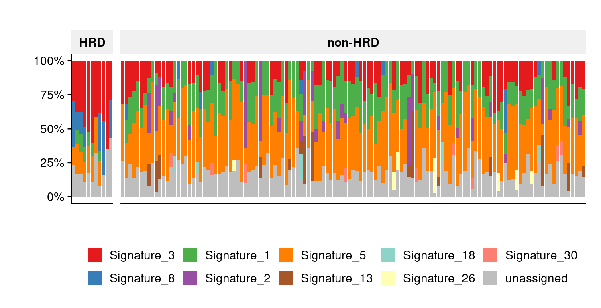
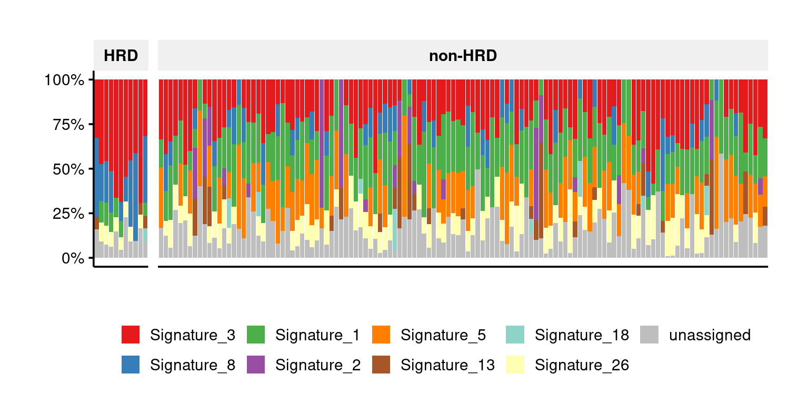

FFPE signature correction in
================

We followed the [FFPEsig](https://github.com/QingliGuo/FFPEsig) method
from [Qingli Guo et al.,
2022](https://www.nature.com/articles/s41467-022-32041-5) to correct the
FFPE signatures in samples of MAGIC cohort.

We used
[SigProfilerExtractor](https://github.com/AlexandrovLab/SigProfilerExtractor)
to generate the mutational catalogus matrix with 96 channel which is a
intermediate file of the signature extraction process, the vcf files of
MAGIC cohort were used as input.

``` python
sig.sigProfilerExtractor(input_type="vcf",
  input_data=data/GRCh38/MAGIC,
  output=results/GRCh38,
  reference_genome="GRCh38",
  cosmic_version="3.2",
  context_type="96",
  minimum_signatures=2,
  maximum_signatures=10,
  nmf_replicates=100,
  cpu=30)
```

``` bash
python scripts/sort_SBS_channel.py results/GRCh38/MAGIC/COSMIC2/SBS96/Samples.txt data/GRCh38/MAGIC.sorted.matrix.txt
cut -f2- data/GRCh38/MAGIC.sorted.matrix.txt | sed 's/\t/,/g' > data/GRCh38/MAGIC.sorted.matrix.csv
for sample in `head -n 1 data/GRCh38/MAGIC.sorted.matrix.csv| tr ',' ' '`; do
      python scripts/FFPEsig.py --input data/GRCh38/MAGIC.sorted.matrix.csv \
      --sample $sample --label Unrepaired --output MAGIC_ffpe_unrepaired_fixing
 done
paste MAGIC_ffpe_unrepaired_fixing/*_corrected_profile.csv > data/GRCh38/MAGIC.ffpe_unrepaired_corrected.matrix.txt
python scripts/sort_SBS_channel.py data/GRCh38/MAGIC.ffpe_unrepaired_corrected.matrix.txt data/GRCh38/MAGIC.ffpe_unrepaired_corrected.extractor_sorted.matrix.txt --reverse
```

Then extracted SBS signatures and predicted HRD with corrected
mutations.

### SBS signature of MAGIC samples before FFPE correction



### SBS signature of MAGIC samples after FFPE correction



We obervered changes in Signature 3 proportion in samples and signature
30 disappeared as expected.
